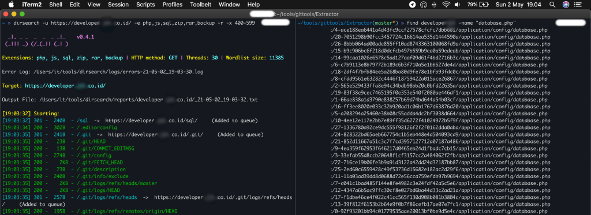
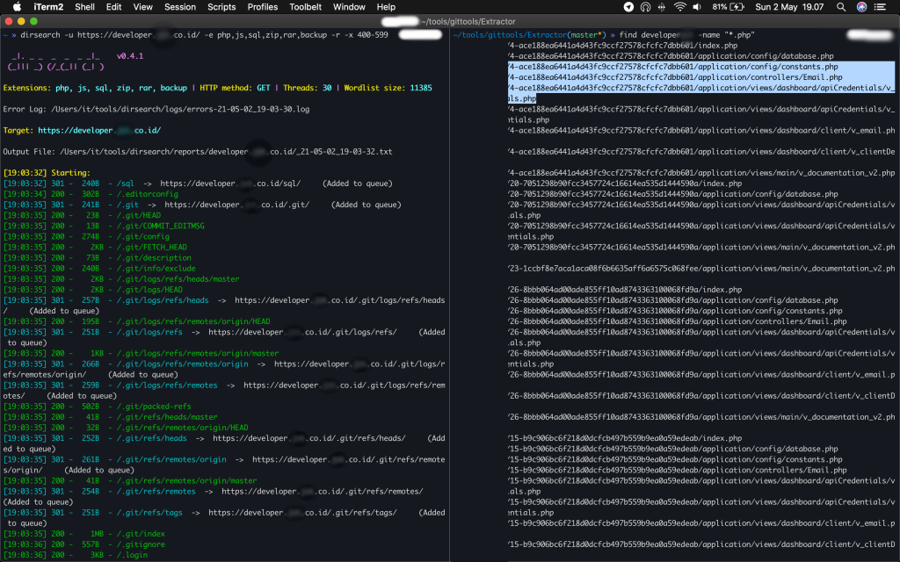
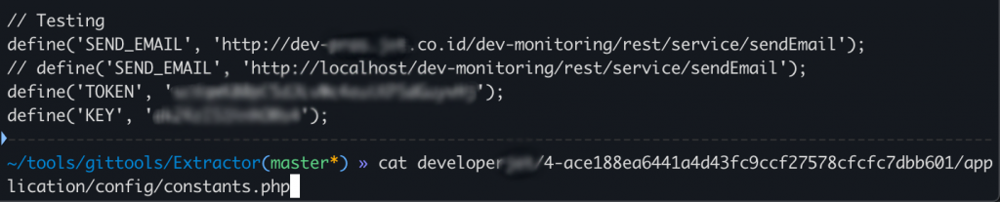
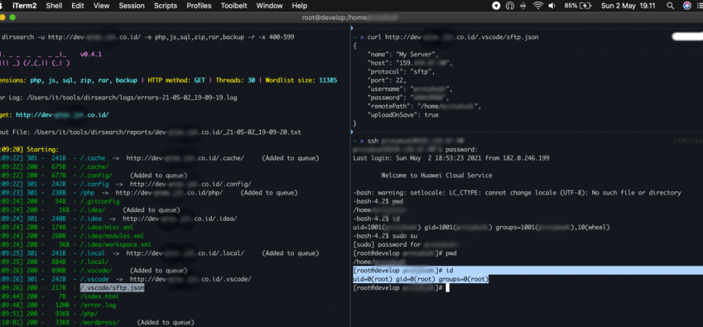
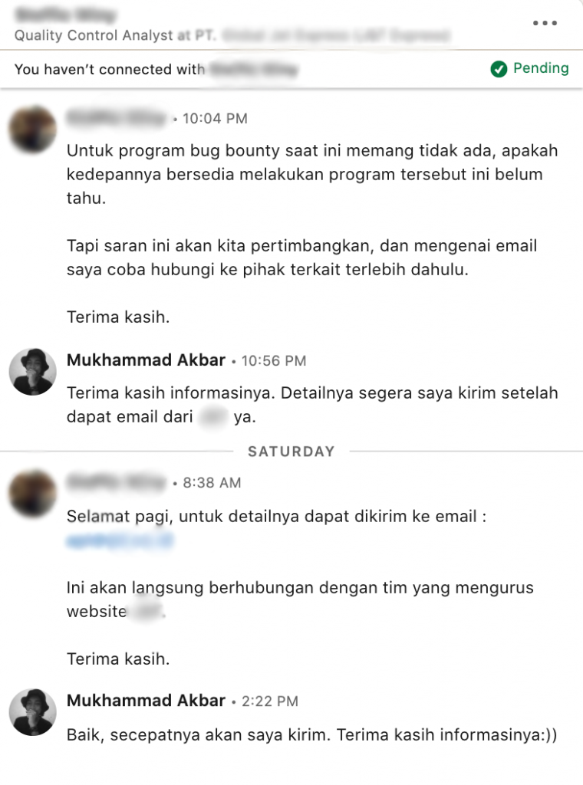

**Akses Root pada Server Penyedia Layanan Ekspedisi Indonesia** - Pos ini adalah _write up_ untuk temuan bug yang saya laporkan ke salah satu penyedia layanan ekspedisi di Indonesia. Temuan bug yang sederhana tapi memiliki _impact_ yang besar. Saya menemukan file konfigurasi sFTP di salah satu subdomain `*.redacted.co.id`.

### Scanning

Saya melakukan _directory scan_ pada subdomain _developer.redacted.co._id menggunakan [DirSearch](https://github.com/maurosoria/dirsearch) dengan menggunakan `command`:  
`dirsearch -u https://developer.redacted.co.id/ -e php,js,sql,zip,rar,backup -r -x 400-599`
- `-e` digunakan untuk _extension_
- `-r` recursive
- `-x` exclude digunakan untuk tidak menampilkan output jika memiliki response code 400-599

Ternyata pada subdomain _developer.redacted.co.id_, kita bisa melihat direktori `.git/` yang bisa diakses oleh siapapun. Seperti [sebelumnya](https://akbar.kustirama.id/miskonfigurasi-hingga-login-ke-email-situs-berita-di-indonesia/), saya mengekstrak isi direktori tersebut menggunakan [GitTools](https://github.com/internetwache/GitTools).

Baca juga: [Login Email Situs Berita di Indonesia](https://akbar.kustirama.id/miskonfigurasi-hingga-login-ke-email-situs-berita-di-indonesia/)

Dari hasil ekstrak tersebut, saya menemukan bahwa _developer.redacted.co.id_ menggunakan _framework_ CodeIgniter.

- find developer -name "database.php" -> mencari file dengan nama `database.php` di dalam direktori `developer`.

Sayangnya saya tidak bisa langsung login ke database _developer.redacted.co.id_ melalui username dan password yang ada dalam file konfigurasi `database.php`. Saya mencari file lain yang saya rasa mengandung informasi lain.

Saya menemukan file berisi beberapa informasi yang berguna lainnya di dalam file `constans.php` dan beberapa file _controller_ yang ada.

### Akses Root pada Server Penyedia Layanan Ekspedisi Indonesia

Saya menemukan subdomain lain yaitu `dev-user.redacted.co.id`. Saya melakukan _directory scan_ juga pada subdomain tersebut dan menemukan file `.vscode/sftp.json` yang berisi username dan password untuk koneksi server tersebut dengan Visual Studio Code, seperti penjelasan dari [Codepolitan](https://www.codepolitan.com/tips-upload-project-lewat-sftp-langsung-dari-dalam-visual-studio-code).

Saya berhasil login menggunakan username dan password yang tersedia. Saya mendapat akses root untuk server `developer.redacted.co.id`.

Saya mencoba melaporkan temuan ini melalui beberapa orang yang bekerja di perusahaan tersebut yang saya temukan di LinkedIn. Sayangnya, saat ini pihak perusaah belum mempunyai program _bug bounty_.

**Pos ini saya terbitkan atas persetujuan pihak yang saya hubungi**. Semoga bermanfaat, sampai jumpa pada pos selanjutnya.
