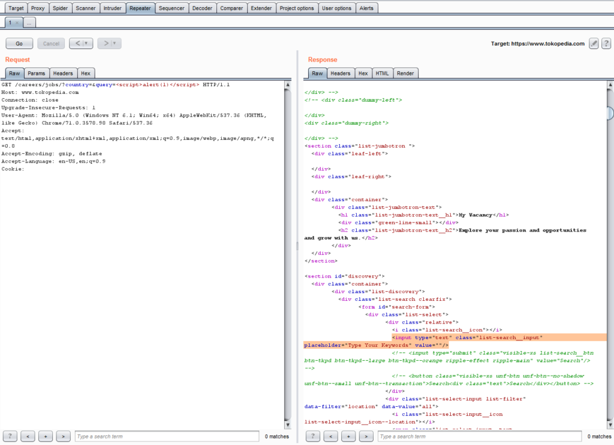
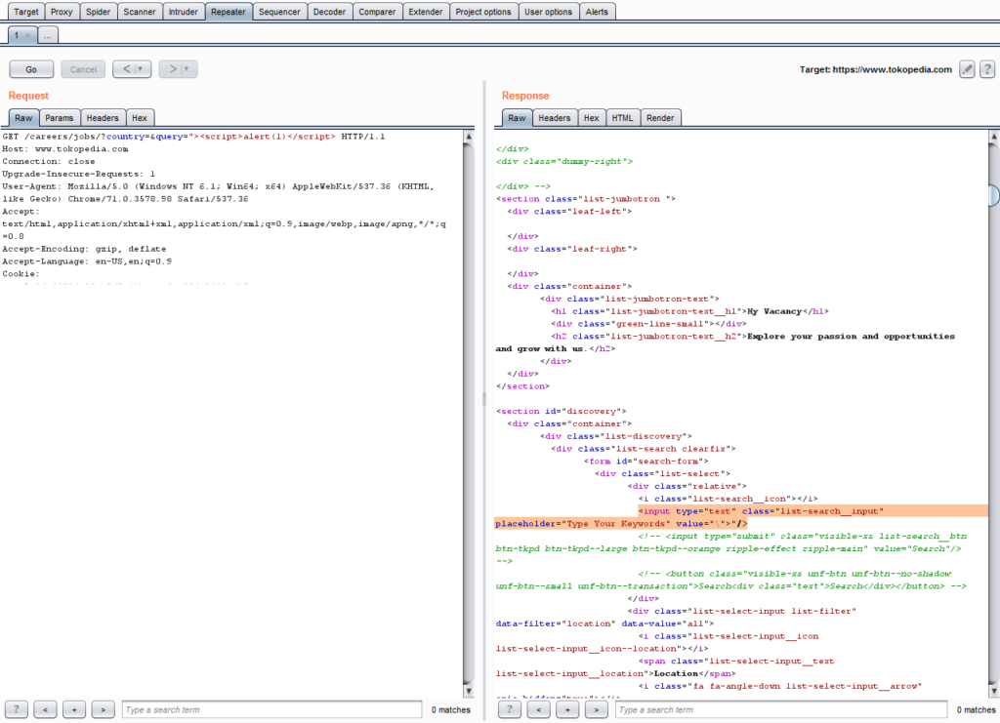
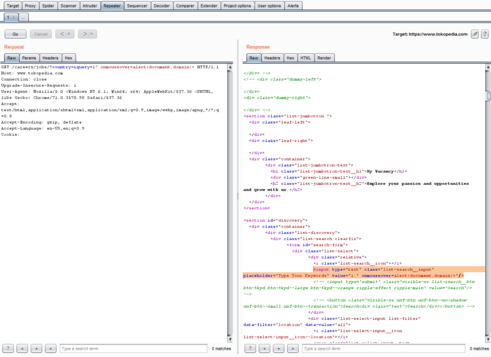
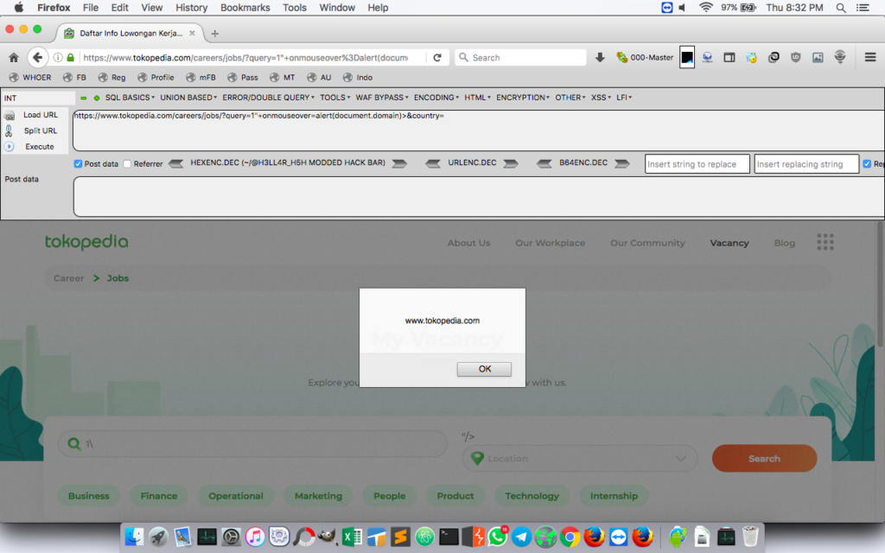
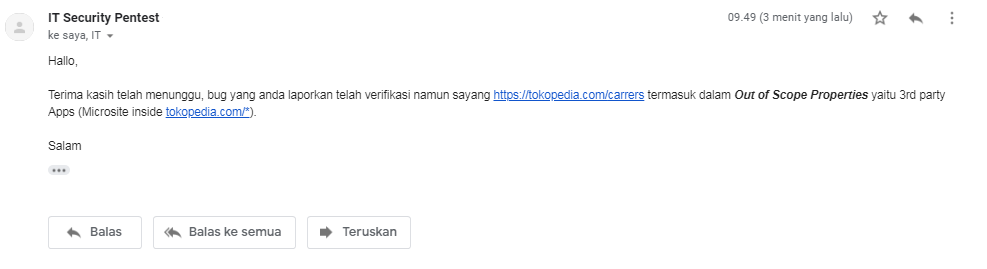

**Bug Bounty Tokopedia** - **Tokopedia** merupakan perusahaan teknologi Indonesia dengan misi mencapai pemerataan ekonomi secara digital. Sejak didirikan pada tahun 2009, **Tokopedia** telah bertransformasi menjadi sebuah unicorn yang berpengaruh tidak hanya di Indonesia tetapi juga di Asia Tenggara. - Wikipedia.

Berawal karena bosan, beberapa hari yang lalu saya menemukan bug pada situs Tokopedia. Tepatnya Reflected XSS pada halaman karir Tokopedia (https://www.tokopedia.com/careers/).

Baca juga: [Membuat XSS Cookie Stealer](https://akbar.kustirama.id/membuat-xss-cookie-stealer/).

### Bug Bounty Tokopedia: Reflected XSS Tokopedia

Setelah lumayan lama berkutat pada domain utama **tokopedia.com** , saya mulai frustasi karena tidak mendapatkan apapun. Saya memutuskan untuk mencari pada sub-sub nya dan menemukan [halaman karir](https://www.tokopedia.com/careers/) yang terdapat form input disana.

Saya langsung memasukkan payload `` pada form tersebut, namun gagal dan langsung dihapus. Sepertinya harus melakukan dengan kasih sayang bypass pada filter nya.

Saya mencoba mem-bypass filter tersebut dengan menambahkan penutup tag HTML. Sehingga payload XSS saya menjadi `">`, namun lagi - lagi gagal. Asumsi saya tag HTML sudah masuk _blacklist_ karakter yang diinputkan oleh pengguna.

Sampai sini saya menyadari sesuatu. Karakter yang diinputkan pengguna akan ditampilkan di tag input pada atribut `value`. Saya langsung berpikir bagaimana jika hanya menambahkan atribut lain tanpa tag HTML?

Okeee kita coba! Saya rombak payload saya menjadi `" onmouseover=alert(document.domain)>`. Kenapa begitu? Saya jelaskan satu - persatu.

1. **Double quote (")** saya gunakan untuk menutup atribut `value` yang seharusnya berisi inputan pengguna.
2. `onmouseover=alert(document.domain)` adalah event yang saya gunakan untuk men-trigger sehingga nanti muncul alert.
3. `>` saya gunakan untuk menutup tag `<input>`.

Tentunya setelah itu saya mengakses url vuln tersebut pada browser untuk memastikan apakah ada alert yang muncul. Dan saya berhasil memunculkan alert dari payload XSS yang saya masukkan.

Tentunya tanpa menunggu lama saya segera melaporkan hal ini. Setelah menunggu beberapa waktu, bug yang saya temukan sudah diverifikasi namun tidak masuk pada program Bug Bounty Tokopedia karena _Out of Scope_.

### Timeline

1. Jan 13, 2019 07:35 AM - Mengirim report ke Tokopedia.
2. Jan 13, 2019 08:22 AM - Tokopedia menerima dan sedang memverifikasi bug tsb.
3. Jan 13, 2019 09:49 AM - Tokopedia memberitahu kalau bug yang saya laporkan valid namun Out of Scope.
