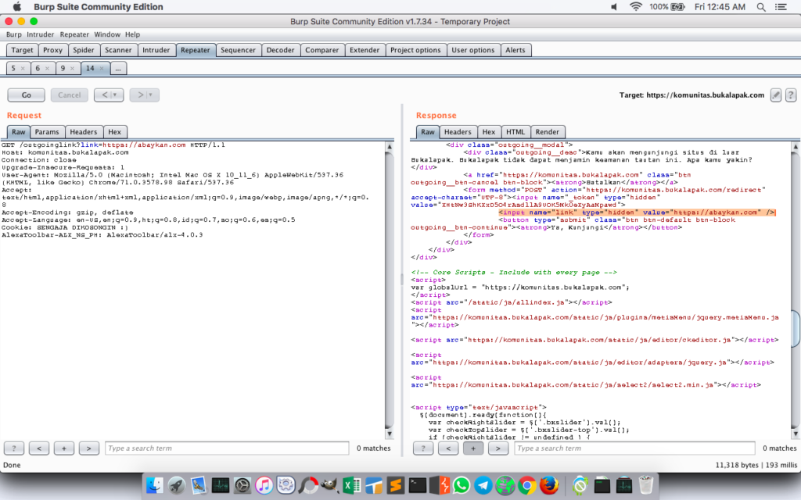
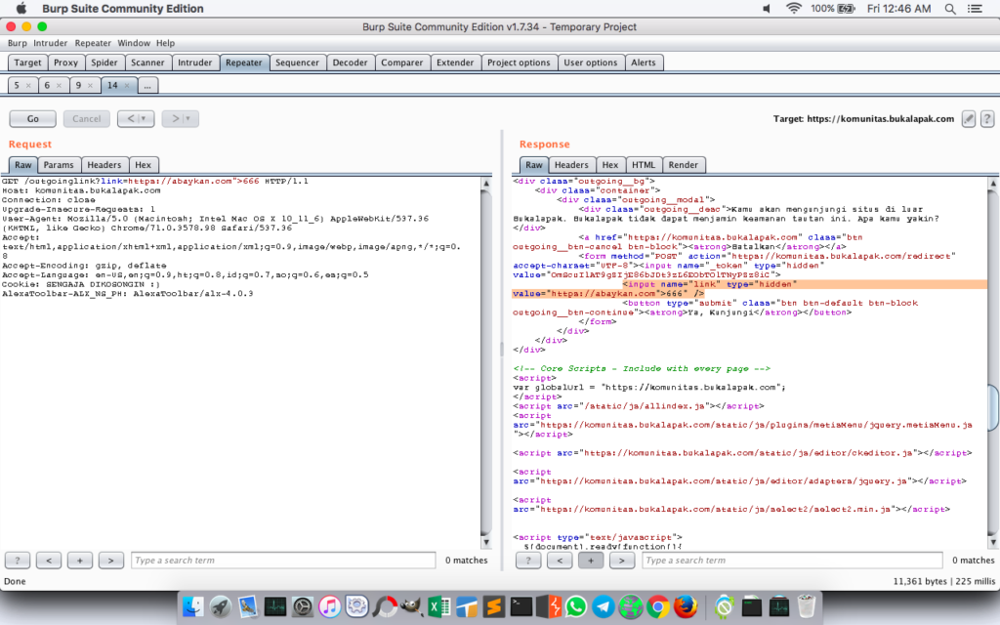
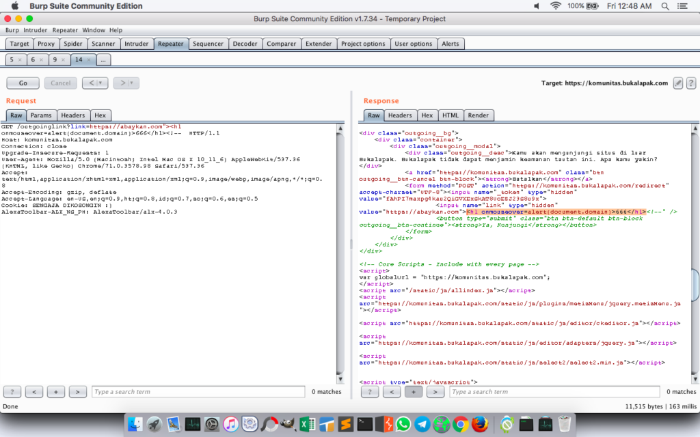
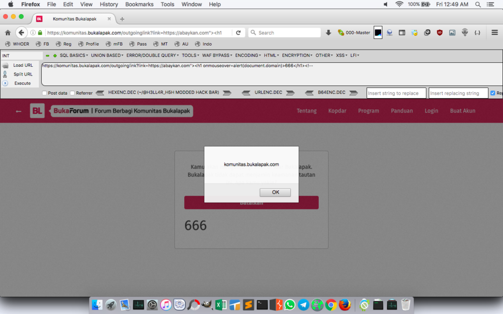
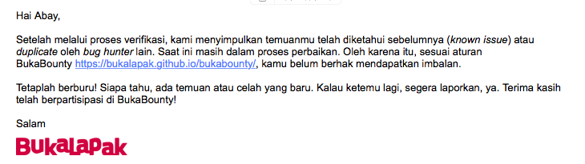
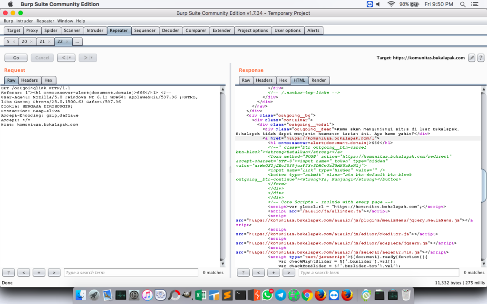
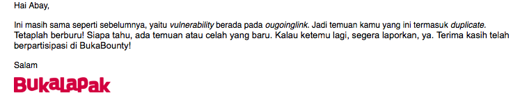

**Bukalapak Bug Bounty** - Bukalapak merupakan salah satu pusat perbelanjaan daring (online marketplace) di Indonesia yang dimiliki dan dijalankan oleh PT. **Bukalapak**. - Wikipedia.

## Bug Bounty BukaLapak: BukaBounty

Bukalapak mempunyai program Bug Bounty yang dinamai **BukaBounty** dimana rincian dari program tersebut bisa kita lihat di [bukalapak.github.io/bukabounty](https://bukalapak.github.io/bukabounty/).

Sebagai wujud penghargaan Bukalapak terhadap partisipasi peserta bug bounty, Bukalapak akan memberikan imbalan untuk setiap laporan celah keamanan yang dapat diproses. Nilai imbalan bervariasi, tergantung pada tingkat risiko dari celah keamanan yang dilaporkan.

Cakupan program bug bounty Bukalapak adalah semua konten yang berada pada domain berikut:

- www.bukalapak.com
- m.bukalapak.com
- api.bukalapak.com
- komunitas.bukalapak.com

## Reflected XSS pada Subdomain Komunitas

Saya menemukan halaman pembatas antara Bukalapak dan Eksternal link. Mungkin halaman ini ada untuk memperingatkan pengguna sehingga tidak masuk pada situs berbahaya.

Baca juga: [Cross Site Scripting: Dasar - Dasar XSS](https://akbar.kustirama.id/cross-site-scripting-dasar/).

Halaman yang saya maksud ada di `https://komunitas.bukalapak.com/outgoinglink?link=`. Halaman tersebut menggunakan method `GET` berisi link tujuan sebelum mengalihkan pengguna ke tautan eksternal.

**<!– Link tersebut saya dapat ketika saya melihat salah satu postingan user Komunitas Bukalapak** [**disini**](https://komunitas.bukalapak.com/news/105419-kalau-ada-vps-yang-murah-kenapa-pilih-yang-mahal)**. Pada postingan tersebut, penulis menyertakan link eksternal di akhir postingan. –>**

Daaan, setelah saya lihat ulang, link yang menjadi isi dari parameter `?link=` tersebut direfleksikan di dalam halaman tersebut. Tepatnya pada tag HTML input: `<input name="link" type="hidden" value="https://abaykan.com" />`.

`https://komunitas.bukalapak.com/outgoinglink?link=https://abaykan.com`

Saya mencoba memasukkan beberapa karakter untuk mengetahui apakah karakter yang saya masukkan diterima pada halaman tersebut. Setelah mencoba dengan memasukkan `">666` sebagai isi parameter tersebut, ternyata berhasil. Sehingga tag `<input>`sudah tertutup.

Setelah mengetahui hal ini, saya langsung memasukkan payload XSS sebagai isi parameter tersebut. Dan hasilnya,

Tentunya setelah itu saya mengakses url tersebut pada browser untuk memastikan apakah ada alert yang muncul. Dan saya berhasil memunculkan alert dari payload XSS yang saya masukkan.

Setelak cek ulang dan yakin bahwa ini memang bug, saya segera melaporkan ini pada Bukalapak. Beberapa jam kemudian Bukalapak memeverifikasi bahwa temuan saya valid namun masuk dalam _known issue_ atau _duplicate_.

## Memasukkan Payload XSS pada HTTP Header

Tidak menyerah sampai di situ, saya meriset ulang halaman tersebut. Dan saya melihat sesuatu yang menarik. Ternyata pada HTTP Header terdapat input `Referer` dimana saya juga bisa memasukkan payload XSS yang ter-eksekusi dengan baik.

  

XSS tanpa alert tentu terasa garing kan? Tentu saya mencoba membuka URL tersebut pada browser, silahkan lihat video dibawah ini:

Namun ternyata temuan baru saya masih dianggap sebagai bug yang sama, sehingga statusnya tetap _duplicate_. Sepertinya memang harus sampai sini dulu :D

Atas syarat dari Bukalapak, screenshot email yang saya lampirkan hanya bagian body, tanpa header dan footer yang berisi alamat dll.

## Timeline

1. Jan 25, 2019 03:32 AM - Mengirim laporan bug pada Bukalapak.
2. Jan 25, 2019 10:43 AM - Bukalapak memverifikasi bahwa temuan saya _duplicate_.
3. Jan 25, 2019 09:52 PM - Mengirim ulang temuan yang baru.
4. Feb 03, 2019 09:00 AM - Bukalapak memverifikasi bahwa temuan baru saya masih berstatus _duplicate_.
