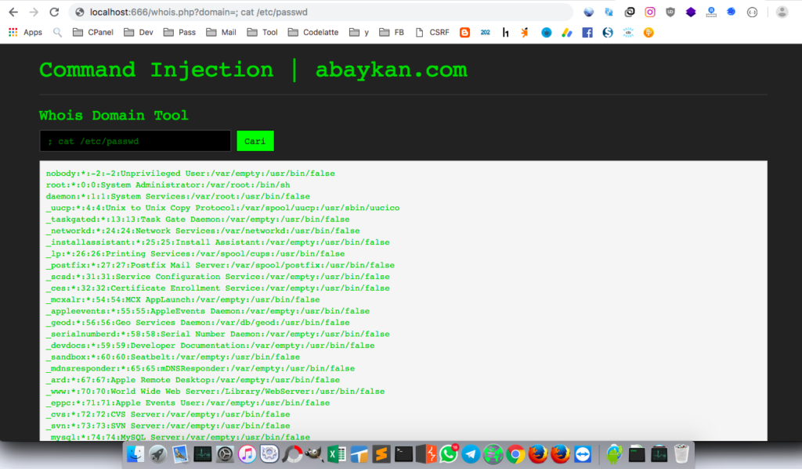

Command Injection adalah kerentanan format string yang terjadi ketika input pengguna yang tidak difilter lalu diteruskan ke shell sistem (`system()`, `exec()`, dll). Seorang penyerang dapat mengeksploitasi kerentanan ini dengan urutan perintah yang ditambahkan ke format yang sesuai untuk mengeksekusi perintah shell. Penyerang yang mengeksploitasi kerentanan ini mungkin juga memiliki _remote-shell_.

## Command Injection atau RCE?

Sebelum masuk lebih dalam, Command Injection tidak sama dengan Remote Code Execution (RCE).

"Perbedaannya adalah bahwa RCE, kode pemrograman aktual dieksekusi, sedangkan dengan Command Injection, ini merupakan perintah (OS) yang dieksekusi. Dalam hal ini, impact yang mungkin terjadi hanya merupakan perbedaan kecil, tetapi perbedaan utama adalah bagaimana kita menemukan dan mengeksploitasi hal tersebut." -[HackerOne](https://www.hackerone.com/blog/how-to-command-injections).

**Selama pengujian, ingat bahwa input HTTP apa pun bisa rentan terhadap Command Injection.**

Pengujian untuk Command Injection dimungkinkan dengan menambahkan perintah ke salah satu dari karakter berikut:

- `;`
- `|`
- `&`
- `&&`
- `$()`

### Command Injection: Contoh Source Code

**whois.php**:

Dari source code diatas dapat dilihat jika saat melakukan perintah `whois`tidak ada filter apapun sehingga string apapun dapat masuk kesana.

Pada shell UNIX, perintah dapat disuntikkan dalam beberapa cara.

- Menggunakan titik koma sebagai pembatas perintah:

`cd ~; ls`

- Menggunakan ampersand:

`cd ~ && ls`

- Menggunakan operator`|`bash untuk merangkai perintah bersama:

`ls | grep filename`

Penyerang bisa menggunakan semua cara itu untuk menyuntikkan dan mengeksekusi perintah:

- `/whois.php?domain=www.google.com;cat /etc/passwd`
- `/whois.php?domain=;whoami; id`

## Mencegah Command Injection

Ada beberapa cara untuk menghindari dan / atau mengurangi kerentanan Command Injection. Dalam urutan kepentingan, mereka adalah:

### Jangan melakukan `exec` ke Sistem Operasi jika itu dapat dihindari

Ini adalah solusi terbaik jika dapat diadopsi karena menghilangkan risiko. Berusaha keras untuk melakukan pekerjaan aplikasi di dalam aplikasi.

### Validasi input

Semua input ke aplikasi yang belum divalidasi sebelumnya harus diperiksa untuk memastikan memenuhi ketentuan aplikasi. Gunakan "whitelist validation", yang berarti bahwa aplikasi memverifikasi bahwa input sesuai dengan apa yang diterimanya dan menolak segala sesuatu yang lain. Validasi Input dapat mencakup validasi input:

- Character set
- Minimum and maximum length
- Numeric bounds
- Date bounds
- Match to a Regular Expression Pattern

### Netralkan meta-karakter yang memiliki makna di baris perintah OS target:

- **Untuk Windows**: Awali setiap karakter dengan ‘^’ untuk “melarikan diri” dan menetralkan makna khususnya kepada penerjemah baris perintah: `() <> & * ‘| =? ; [] ^ ~! . ”% @ / \: +,`.
- **Untuk Linux dan Unix**: Awali setiap karakter dengan ‘\\’ untuk menghindarinya dan menetralkan makna khususnya kepada penerjemah baris perintah: `{} () <> & * ‘| =? ; [] $ - # ~! . ”% / \: +,`

Menerapkan "Least Privilege": Meskipun tidak akan membantu mencegah atau menghindari kerentanan Perintah Injeksi, membatasi kekuatan (Izin) dari akun yang digunakan untuk menjalankan perintah OS akan membantu mengurangi potensi kerusakan.

## Penutup

Command Injection adalah salah satu kerentanan keamanan paling serius yang dapat muncul dalam suatu aplikasi dan harus sangat hati-hati saat menggunakan OS untuk menjalankan perintah.

Source Code file yang ada diatas bisa didapatkan di [github.com/abaykan/Labs](https://github.com/abaykan/Labs/blob/master/command-injection.php).
