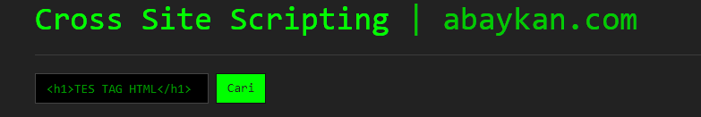

**Cross Site Scripting (XSS)** pada dasarnya menyuntikkan skrip atau HTML ke halaman web, seberapa burukkah akibatnya? Jika kita melihat XSS sebagai bug yang tidak berbahaya, sepertinya harus dipikir ulang. Jika Google saja membayar hingga *$3,133.7* untuk satu bug XSS, itu berarti itu sangat buruk, kan?

Serangan XSS dilakukan di sisi klien. Ini dapat dilakukan dengan bahasa pemrograman sisi klien yang berbeda. Jika masih belum terbiasa dengan konsep dasar XSS, saya sarankan kalian membaca [Cross Site Scripting (XSS)](https://www.owasp.org/index.php/Cross-site_Scripting_(XSS)).

### Cross Site Scripting: XSS-Vulnerable Code

Setelah kita paham berbagai jenis XSS, mari kita menuju ke apa yang bisa digunakan oleh penyerang. Lagi pula, XSS pada dasarnya hanya menyuntikkan skrip atau HTML ke halaman web, seberapa burukkah dampaknya? Mari kita buat script xss-vulnerable kita sendiri!

Contoh paling sederhana tentang script yang vuln terhadap XSS adalah:

Mengapa? Karena pada script tersebut belum ada filter apapun pada karakter yang dimasukkan.

Pada script diatas, saya tambahkan sedikit bumbu Bootstrap agar tidak terlalu garing :D Sehingga tampilannya akan menjadi seperti ini:

Pada form pencarian tersebut, jika kita memasukkan keyword pencarian, keyword tersebut akan ditampilkan pada `Hasil pencarian`.

Secara umum, saat menguji kemungkinan serangan XSS, validasi input harus diperiksa dan tester harus sadar saat memeriksa output situs web. Juga jika tinjauan kode sedang dilakukan, penting untuk menemukan bagaimana input dapat masuk ke output.

Pada script sederhana diatas, kita bisa memasukkan apa saja pada `keyword pencarian` **termasuk** tag HTML. Kita coba memasukkan tag HTML pada form tersebut, hasilnya:

Form pencarian tersebut saya buat menggunakan method `GET`jadi kita juga bisa mengganti keyword pencarian melalui URL tersebut.

Baca juga: [Membuat XSS Cookie Stealer](https://akbar.kustirama.id/membuat-xss-cookie-stealer/).

XSS tanpa memunculkan `alert` bisa kita bilang seperti taman tak berbunga :p Karena saya menggunakan _Google Chrome_, saya menambahkan `header('X-XSS-Protection: 0');` pada code tersebut agar tetap bisa memunculkan `alert`.

Saya memasukkan `` pada form pencarian.

## Mencegah Serangan XSS

Meskipun jenis serangan ini dianggap sebagai salah satu yang paling berbahaya dan berisiko, masih ada beberapa rencana pencegahan yang harus disiapkan. Karena populernya serangan ini, ada banyak cara untuk mencegahnya.

Beberapa cara yang biasa digunakan adalah:

- [Validasi Data](https://codelatte.org/validasi-ekstensi-file-pada-javascript/).
- Memberi filter pada karakter yang di-inputkan pengguna.
- Escaping.

Langkah pertama dalam pencegahan serangan ini adalah Validasi input. Semuanya, yang dimasukkan oleh pengguna harus divalidasi dengan tepat, karena input pengguna dapat ditampilkan kembali di bagian output. Validasi data dapat dinamakan sebagai dasar untuk memastikan keamanan sistem.

Memvalidasi inputan pengguna mungkin hanya membantu mengurangi risiko, tetapi mungkin tidak cukup untuk mencegah kemungkinan kerentanan XSS.

Metode pencegahan lain adalah pemfilteran input pengguna. Maksud dari penyaringan adalah untuk mencari kata kunci 'berbahaya' yang di input pengguna dan menghapusnya atau menggantinya dengan string kosong. Beberapa string yang saya maksud adalah:

- ``.
- Javascript commands.
- Tag HTML.

## Penutup

Saat menguji, sangat disarankan untuk mengevaluasi risiko yang membawa kemungkinan serangan XSS. Serangan XSS dapat memengaruhi aplikasi web, yang jika dilihat sekilas masih tampak aman.

Source code dari file yang ada pada screenshot saya diatas bisa didapat kan di [github.com/abaykan/Labs](https://github.com/abaykan/Labs/blob/master/cross-site-scripting-basic.php).

XSS dianggap sebagai salah satu serangan paling berbahaya dan berisiko. Karenanya, kita tidak boleh melupakan jenis pengujian ini. Saat melakukan pengujian terhadap XSS, penting untuk memiliki pengetahuan yang baik tentang serangan ini. Dan ini adalah dasar untuk menganalisis hasil pengujian dengan benar dan memilih alat pengujian yang sesuai.
