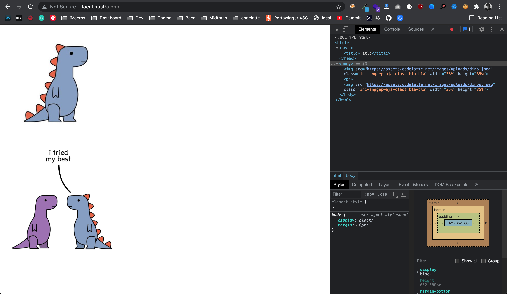

**Menambahkan Atribut Size (Width dan Height) pada Tag Image** - Tulisan ini cuma catatan pribadi karena saya ngga ngerti _regex_.

Saya mendapat sebuah _case_ menambahkan atribut ke dalam tag `` yang tidak mempunyai `height` dan `width` spesifik. Setelah mencoba beberapa cara, akhirnya ditemukan cara yang paling sederhana adalah menggunakan `preg_replace()`.

Kode yang saya gunakan:
```
$html_content = preg_replace('/(/', '$1 width="35%" height="35%"></img>', $html_content);
```

Contoh keseluruhan kode:

```php
<?php
$html_content = '
<!DOCTYPE html>
<html>
<head>
	<title>Title</title>
</head>
<body>
	
	<br/>
	
</body>
</html>';

$html_content = preg_replace('/(/', '$1 width="35%" height="35%"></img>', $html_content);
echo $html_content;
```

Hasilnya seperti yang terlihat di bawah ini.

