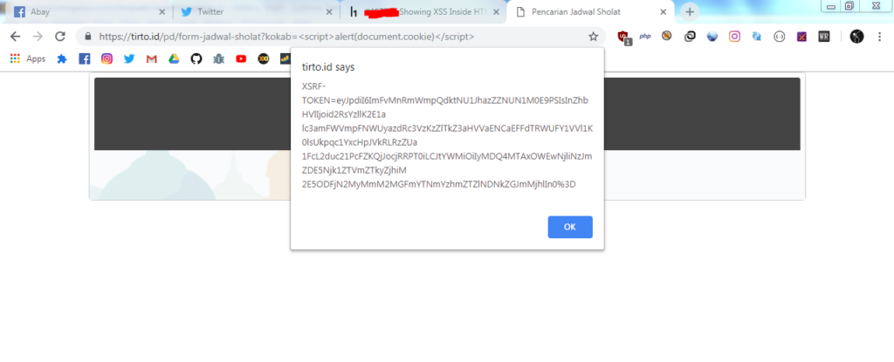
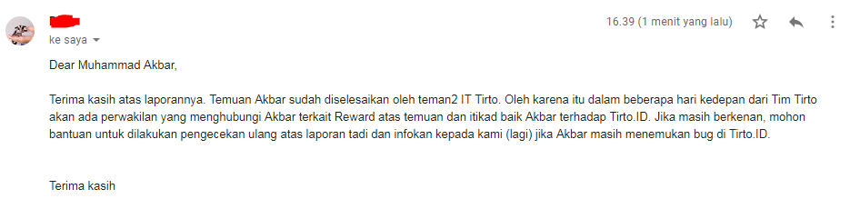

**Mendapat Hadiah dari Pak Tirto** - Postingan ini adalah write up saya saat menemukan Multiple Vulnerability pada situs [Tirto.id](https://tirto.id/). Sebelum melanjutkan, silahkan baca [Disclaimer](https://akbar.kustirama.id/disclaimer/) terlebih dahulu. Jika kamu setuju dengan pernyataan disana, silahkan melanjutkan membaca :)

## Apa itu Tirto.id?

**Tirto.id** adalah sebuah situs berita, artikel dan infografik di Indonesia. Situs berita **Tirto.id** didirikan oleh Atmaji Sapto Anggoro yang sekaligus menjabat sebagai Pimpinan Redaksi dan CEO. Sajian tulisan **Tirto.id** meliputi rubrik Mild Report, Indepth, Hardnews, Current Issue, dan Tirto Visual Report (TVR).

**Tirto.id** menerjemahkan visi mencerahkan itu sebagai keharusan menyajikan tulisan-tulisan yang jernih, mencerahkan, berwawasan, memiliki konteks, mendalam, investigatif, faktual.

*Dikutip dari tirto.id/insider/tentang-kami dan Wikipedia.*

Sejujurnya, Tirto.id adalah situs berita yang lebih sering saya baca (karena saya agak malas membaca) daripada situs berita lain.

Dengan bacaan berbobot namun santai, bertemakan Sejarah, Informasi Unik sampai Politik dan Berita Terkini (Current Issue), kita bisa menambah wawasan atau sekedar mengikuti berita terbaru dengan tatanan bahasa yang mudah kita pahami.

**Intinya saya suka Tirto.id, titik.**

Berawal dari rasa suka pada situs berita ini. Dengan bermodal iseng, pengetahuan terbatas dan segelas kopi, saya melakukan tes pada situs **Tirto.id**.


## Temuan Bug pada Situs Tirto.id

Singkat cerita saya langsung melakukan test pada website **Tirto.id**, dan ternyata saya menemukan **Unauthenticated Iframing** (atau apapun namanya) dan **Reflected XSS** disana.

### Unauthenticated Iframing?

Sebenarnya saya kurang tau pasti apa nama dari bug ini. Yang pasti seseorang bisa memasukkan link apapun ke dalam `<iframe>` yang ada di situs **Tirto.id**. Silahkan koreksi di kolom komentar.

Saya menemukan URL dengan disertai parameter `?url=` yang value nya akan direfleksikan sebagai sumber (src) dan tanpa ada validasi atau filter apapun sehingga attacker bisa memasukkan URL apa saja termasuk URL Phising dsb.

**[redacetedurl]/?url=http://evil.com/**

Value dari parameter `?url=` akan direfleksikan pada halaman, sehingga menjadi:

```
Loading....
```

Saya tahu mungkin beberapa orang akan berpikir dan mencoba untuk melakukan [Local File Inclusion](https://akbar.kustirama.id/local-file-inclusion/), tapi sudah saya coba beserta mencari referensi lain tentang bypass LFI, tetap gagal.

**Apa dampak dari bug ini?** Jika diibaratkan `evil.com` adalah halaman Phising (Facebook, Twitter dsb) maka korban akan lebih yakin karena URL nya berasal dari domain **Tirto.id**.

**Karena perihal izin, saya tidak menunjukkan URL maupun melampirkan screenshot bagian ini.**

_Tapi kalau hanya ini apa sudah cukup untuk "menarik perhatian" Pak Tirto?_  
Oke, kita cari lagi.


### Reflected XSS

Selanjutnya, Reflected XSS yang ada pada `https://tirto.id/pd/form-jadwal-sholat?kokab=`. Seperti sebelumnya, value dari parameter akan direfleksikan ke dalam halaman.

Namun disini attacker bisa memasukkan Javascript ke dalam value parameter tersebut. Sehingga impact yang paling parah adalah mencuri data kredensil milik pengguna (atau mungkin admin/penulis) **Tirto.id**.



Ternyata pada halaman tersebut, belum ada filter untuk value dari parameter tersebut. Sehingga saya bisa memasukkan payload XSS ke dalamnya.

**Apa dampaknya?** Karena tidak ada filter sama sekali, attacker bebas memasukkan payload XSS dan bisa mencuri data kredensil (referensi: [Membuat XSS Cookie Stealer](https://akbar.kustirama.id/membuat-xss-cookie-stealer/)).

_Oke, sekarang waktunya menghubungi Pak Tirto!_

## Mendapat Hadiah dari Pak Tirto

Karena saya tidak tahu bagian mana yang akan menanggapi hal ini, saya melaporkan temuan ini ke semua email yang ada di website Tirto😎

Tidak sampai 2 jam, email saya ditanggapi oleh IT Manager Tirto. Tanpa menunggu lama saya menjelaskan sejenak temuan bug yang saya dapat.



Ternyata tidak perlu menunggu lama saat proses perbaikan (bug diperbaiki dalam waktu kurang dari 4 jam!). Selanjutnya tinggal menunggu tim dari Tirto.id untuk menghubungi saya😂


## Timeline

- Feb 19, 2019 02:21 PM - Mengirim laporan ke Tirto.id.
- Feb 19, 2019 04:39 PM - Bug selesai diperbaiki.
- Mar 08, 2019 - Rewarded.
