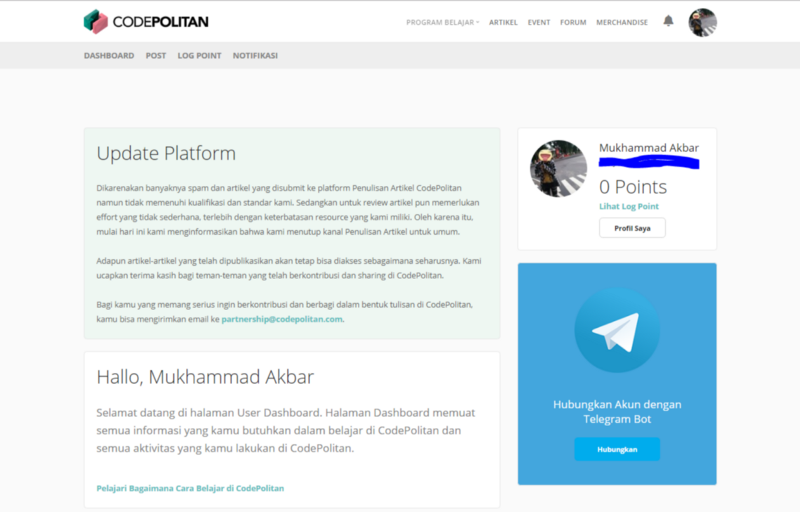
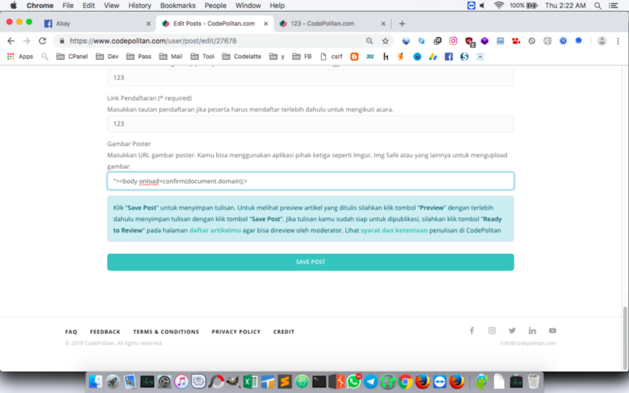
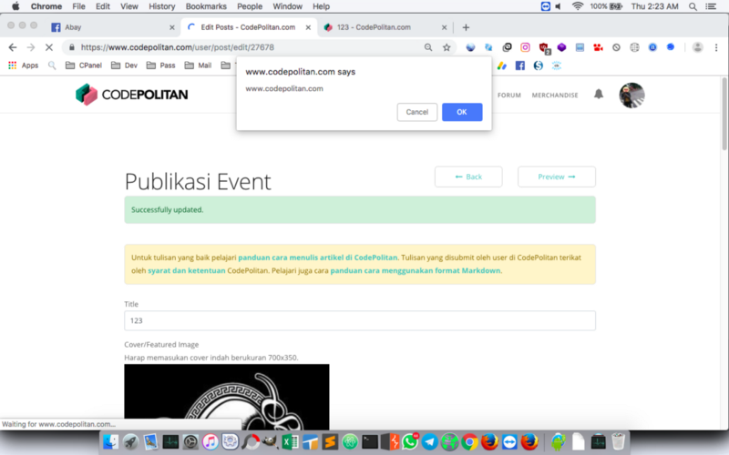

**Mengejar Hall of Fame Codepolitan** - Media edukasi dan informasi tentang pemrograman dan teknologi. Yap, Codepolitan. Dimana kita bisa mendapatkan informasi dan pengetahuan seputar pemrograman dan teknologi, juga dengan konten yang disusun sedemikian rupa dan dalam bahasa Indonesia agar mudah dipahami oleh para developer Indonesia.

### Stored XSS

Stored Cross Site Scripting (XSS) adalah jenis yang paling berbahaya dari XSS. Aplikasi web yang memungkinkan inputan dari pengguna untuk disimpan dan menampilkan nya pada suatu halaman berpotensi terkena serangan jenis ini. -[sumber](https://www.owasp.org/index.php/Testing_for_Stored_Cross_site_scripting_%28OTG-INPVAL-002%29).

### Mengejar Hall of Fame Codepolitan

Sebelumnya saya melihat write up salah satu teman di facebook, disana ia menulis write up dari bug yang ia temukan di situs Codepolitan. Dari sana pula teman saya ini masuk halaman Hall of Fame.

[Codepolitan.com PHP Code Injection & Get Root Server](https://medium.com/@ardhana/codepolitan-com-php-code-injection-get-root-server-c6a8fe099b76) - @Ardhan.

Dari situ saya berpikir "_apakah bisa saya ikut masuk ke halaman HoF?_", tanpa menunggu lagi, langsung saja saya mendaftar pada situs tersebut.

https://www.facebook.com/abaykandotcom/posts/2212427838981930

Setelah mendaftar dan masuk ke dashboard user, mata saya langsung fokus pada kata “**UPDATE PLATFORM**”. Apa ini? Apa Codepolitan baru selesai melakukan update pada website mereka? Kalau memang iya, maka akan lebih besar peluang saya menemukan sesuatu pada aplikasi web yang baru selesai diupdate ini, kan?

Dashboard User Codepolitan

Baca juga: [Membuat XSS Cookie Stealer](https://akbar.kustirama.id/membuat-xss-cookie-stealer/).

Setelah melihat-lihat, saya menemukan halaman **Publikasi Event** , dimana kita bisa mendaftarkan Event yang akan kita selenggarakan untuk dipublish di situs Codepolitan. [https://www.codepolitan.com/user/post](https://www.codepolitan.com/user/post).

Iseng saya langsung mencoba memasukkan payload andalan saya pada salah satu kolom input, tepatnya pada kolom Gambar Poster. 

Dengan harapan masih belum adanya filter pada karakter yang dimasukkan user pada form. Saya mencoba memasukkan payload `"><body onload=confirm(document.domain);>` dan hasilnya,

Payload yang saya masukkan ter-eksekusi dengan baik sehingga memunculkan popup berisi nama domain Codepolitan. Setelah berhasil membuat kalimat yang tepat dan memastikan bahwa ini benar benar XSS yang valid , maka saya langsung melaporkannya ke Codepolitan.

Dan akhirnya nama saya ada di halaman Hall of Fame Codepolitan😝  
[www.codepolitan.com/credit-to-bug-reporter](https://www.codepolitan.com/credit-to-bug-reporter) (Mukhammad Akbar).

### Timeline

1. Dec 27, 2018 02:30 AM - Saya melapor ke Codepolitan.  
2. Dec 27, 2018 01:28 PM - Mendapat respon dari Codepolitan bahwa laporan sudah diterima.  
3. Feb 26, 2019 01:06 PM - Bug patched & Added to Hall of Fame 😍
