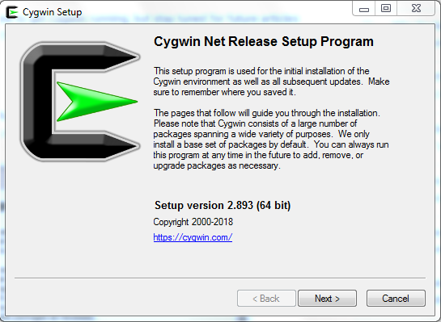
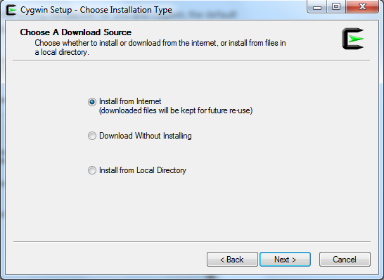
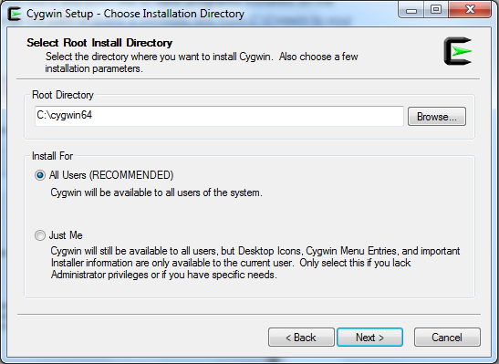
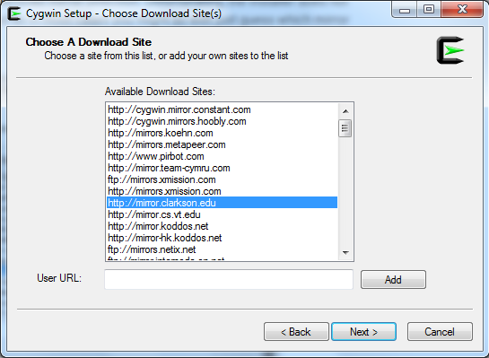
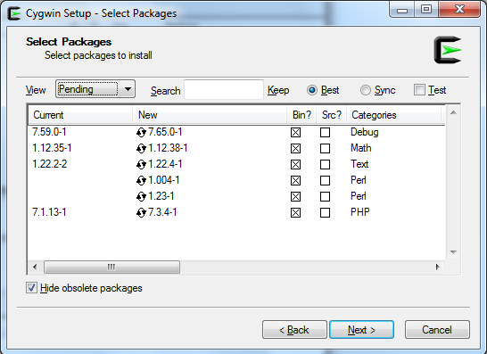
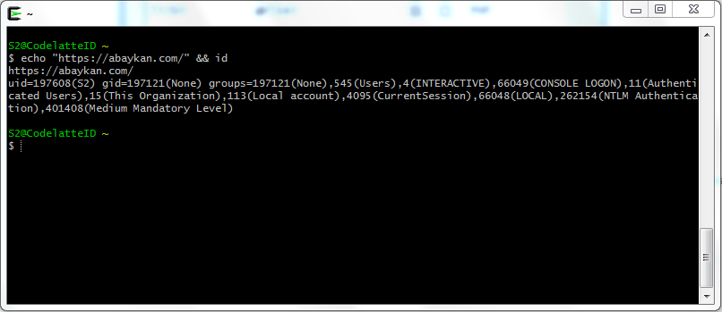

**Menjalankan Command Linux di Windows** - Windows command-line sudah banyak berkembang dengan PowerShell. Tetapi Linux sudah memiliki terminal yang jauh lebih bermanfaat selama bertahun-tahun. Inilah cara untuk mendapatkan yang terbaik dari keduanya, dengan **Cygwin**, terminal *nix-style* untuk PC Windows.

Sebenarnya saya menemukan Cygwin ini secara tidak sengaja. Karena di satu sisi saya ingin menggunakan terminal Linux, di sisi lain PC yang saya pakai adalah PC keluarga yang tidak mungkin juga kalau keluarga saya menggunakan Linux. Di sisi lain lagi PC yang saya gunakan tidak memungkinkan untuk menjalankan Virtual Machine. _Ruwet whoasuuu~_

Setelah lama mencari alternatif di Google, saya menemukan Cygwin. Cygwin hadir dengan `setup.exe` normal untuk menginstal di Windows, tetapi ada beberapa langkah yang perlu kalian perhatikan, jadi saya akan sedikit memandu bagian instalasi. **Saya juga baru beberapa hari menggunakan Cygwin, jadi kalau ada salah kata/bahasa teknis yang saya gunakan, mohon dikoreksi.**

### Instalasi Cygwin

Silahkan download installer pada situs resmi [cygwin.com](https://cygwin.com/install.html). Pilih sesuai PC kalian. Setelah itu langsung buka `setup.exe` dan tampilannya akan menjadi seperti ini:

Untuk menjaga agar instalasi tetap menghemat bandwidth untuk kita dan Cygwin, installer default akan mengunduh file yang kita butuhkan.

Path instal default adalah `C:\Cygwin` tetapi jika kita tidak ingin program diinstal di root drive `C:`, kita dapat mengubah path atau membuat _symbolic link_ dari `C:\Cygwin` ke file program kita.

Klik **Next** hingga datang ke pilihan download mirror. Sayangnya, installer tidak mengatakan di mana mirror itu berada. Jadi dalam kebanyakan kasus kita mungkin juga menebak mirror mana yang paling cocok.

Setelah Anda memilih mirror, installer akan mengunduh _packages_ yang tersedia untuk diinstal.

Akan ada ratusan _packages_ yang tersedia dipisahkan oleh beberapa kategori berbeda. Jika kalian tidak tahu paket apa itu, kalian bisa menggunakan pilihan default dan menginstal paket tambahan semisal _curl_, dll.

Jika kalian tahu _packages_ apa yang kalian butuhkan, kalian dapat mencari dan hasilnya akan disaring secara otomatis.

Setelah kalian mengklik Next, perlu beberapa saat untuk mengunduh semua alat yang dipilih dan kemudian menyelesaikan instalasi.

### Menjalankan Command Linux di Windows

