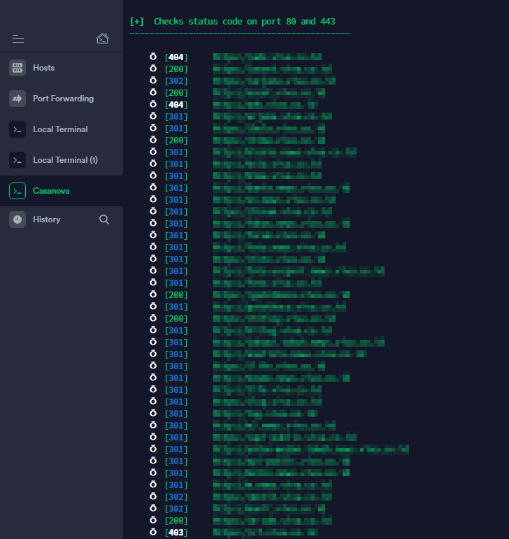

**Login Email Situs Berita di Indonesia** - Singkat cerita, saya mengisi waktu luang untuk mencari _bug_ di salah satu situs media di Indonesia. Kurang cinta apa saya sama media-media di Indonesia?🥰 Kali ini saya menemukan miskonfigurasi yang berujung pada temuan beberapa data penting. Sehingga (salah satu akibatnya) saya bisa login ke email milik situs media tersebut.

**Disclaimer**  
Saya sudah mencoba menghubungi beberapa email yang saya temukan (saya menemukan beberapa email staff IT setelah login ke email situs tersebut) dan beberapa profil lain dengan maksud melaporkan temuan ini. Sayangnya sampai tulisan ini dipublish, belum ada respon dari pihak terkait.

Jika kamu merasa tulisan ini adalah tulisan tentang website yang kamu kelola, silahkan menghubungi saya jika tidak berkenan situs yang kamu kelola berada di sini.

### Login Email Situs Berita di Indonesia

Saya memulai dengan melakukan pencarian subdomain dari situs tersebut menggunakan [Sudomy](https://github.com/Screetsec/Sudomy), dan mendapatkan banyak sekali subdomain milik situs tersebut.

Tentu tidak semua subdomain memberikan "respon positif". Dari sekian banyak subdomain hasil _scanning_, saya mencoba salah satu subdomain dan menemukan halaman login. Saya memasukkan beberapa karakter untuk mencoba potensi adanya _SQL Injection_, namun tidak berhasil. 

**F**.

Saya mencoba mencari direktori yang ada di subdomain tersebut. Untuk melakukan _scanning_ direktori, saya menggunakan [DirSearch](https://github.com/maurosoria/dirsearch), dengan menggunakan command:  
`./dirsearch.py -u https://redacted.co.id/ -e php,js,sql,zip,rar,backup`

Dari hasil _scanning_ tersebut, saya menemukan direktori `.git/` yang digunakan untuk menyimpan informasi tentang _version control_ sebuah project. Saya mencoba memastikan dengan melakukan `curl` ke salah satu file: `curl https://redacted.co.id/.git/index` dan mendapat respon berupa isi file tersebut.

Selanjutnya saya mencoba _dump_ dan _extract_ menggunakan [GitTools](https://github.com/internetwache/GitTools).  
`bash gitdumper.sh https://redacted.co.id/.git/ dirname`

Setelah proses _dump_ selesai, _extract_ direktori `.git/` yang sudah di_dump_:  
`bash extractor.sh ../Dumper/dirname/ dirname/`

Dari proses _extract_ tersebut, saya berasumsi bahwa aplikasi ini menggunakan framework CodeIgniter. Setelah mendapat banyak result dari proses _extract_ tersebut, saya hanya mencari file yang ber-ekstensi PHP.  
`find dirname/ -name "*.php"`

Saya mencoba melihat satu-persatu isi file tersebut dengan harapan akan menemukan sesuatu yang penting. Saya menemukan file yang di dalamnya terdapat data login (SMTP) email milik situs tersebut.

Untuk memastikan apakah data tersebut valid, saya mencoba login menggunakan data tersebut, dan hasilnya:

Saya menghentikan apa yang saya lakukan dan segera menghubungi segala kontak yang bisa saya temukan terkait temuan ini.

### Penutup

Saya sudah mencoba menghubungi pihak situs (via email pada tanggal **10 Agustus 2020**). Sayangnya belum ada respon dari pemilik/staff situs sehingga tentunya tulisan ini belum mendapat izin publish dari pihak situs tersebut. Saya memutuskan menyensor segala informasi yang berhubungan dengan situs tersebut.

Setelah saya cek ulang, per **7 September 2020**, bug ini sudah ditutup. Namun tetap belum ada respon terhadap email saya.

Sekali lagi, jika kamu merasa tulisan ini adalah tulisan tentang website yang kamu kelola, silahkan menghubungi saya jika tidak berkenan situs yang kamu kelola berada di sini.
