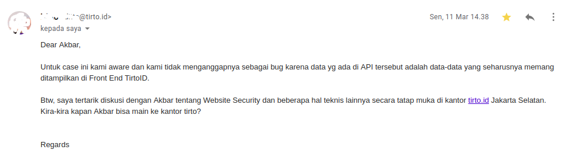

**Ngehack Lalu Direkrut itu Nggak Segampang Kata Orang** - Tulisan ini sebenernya ngga penting kalo yang kalian cari adalah tutorial. Tulisan kali ini cuma pengalaman saat saya ditawari kontrak kerja setelah saya mengirim laporan tentang temuan bug yang saya temukan. _Yang ternyata ga segampang omongan orang - orang_.

Kalau masih belum nyambung, baiknya kalian baca write-up temuan bug saya pada situs Tirto.id di [Mendapat Hadiah dari Pak Tirto](https://akbar.kustirama.id/mendapat-hadiah-dari-pak-tirto/). Tirto.id, sebuah media online yang ternyata memberi apresiasi yang bisa terbilang besar jika dibanding dengan website Indonesia lain yang justru membuka program Bug Bounty, hehe.

## Ngehack Lalu Direkrut itu Nggak Segampang Kata Orang

Setelah laporan temuan saya diperbaiki, saya mengirim ulang temuan bug yang lain (yang ternyata tidak valid xD), namun balasan dari pihak Tirto membuat saya sedikit takut—awalnya. Pada email balasan laporan kedua tersebut, pihak Tirto mengatakan ingin berdiskusi secara langsung, tatap muka, _face-to-face_, di kantor Tirto.

Email Balasan dari Laporan Kedua yang Ternyata Tidak Valid xD

Saya panik. Saya pikir dari pihak Tirto akan memberi warning semacam _"Kan kamu udah pernah ngirim laporan, udah gausah ngirim lagi. Sekali aja"_. Setelah agak lama merenung, saya putuskan untuk tidak berpikiran aneh-aneh dan bersiap menuju kantor Tirto.id, di Jakarta.

Sebenarnya saya beberapa kali ditawari hal serupa, diundang untuk datang ke kantor perusahaan milik website yang pernah saya kirimkan laporan tentang temuan bug. Namun apa daya, saya yang tinggal jauh dari ibu kota tentu berpikir dua kali untuk datang. Selain akan memakan biaya yang lumayan, kadang waktu pertemuan dibanding lama perjalanan itu nggak sebanding, _mz_. _**12 Jam dari Jombang ke Jakarta dan waktu pertemuan cuma 2-3 jam!1!1**_

### Datang ke Kantor Tirto.id

Saat sampai di Jakarta, saya tidak berpikiran jauh. Yang ada di kepala saya cuma, _"Paling cuma ngobrol biasa. Lumayan lah sambil jalan-jalan, itung2 pertama kali ke Jakarta"_.

_Ternyata saya_ salah.

Saya sampai di kantor Tirto tepat jam 10 malam, _iya, saya tau emang kurang ajar kalo bertamu jam segitu, maaf ya bapak-bapak, hehe_. Setelah berbincang-bincang sebentar tentang saya dan kegiatan "_hek-hek-an_" saya yang masih bisa dibilang amatir. Sampai akhirnya obrolan mulai masuk ke pembahasan yang serius. Saya ditawari belajar, percobaan kerja, magang (atau apalah namanya, saya bingung) di Tirto.id sebagai tim IT selama 3 bulan. _Sekali lagi, saya panik_.

Saat mendapat tawaran tersebut, tentu saya sangat-sangat tertarik. Tapi tentu ada beberapa pertimbangan yang harus saya pikirkan dulu sebelum saya-nantinya-akan menetap di Jakarta selama magang tersebut.

Dan untungnya pihak Tirto juga mengerti tentang kebimbangan saya. Sampai akhirnya mereka menjelaskan benefit yang akan saya dapat jika saya menerima tawaran tersebut.

Dan yang paling saya ingat, kata-kata yang intinya adalah, "Kalau selama 3 bulan magang nanti kamu dinilai bisa meng-_handle_ tugas yang kita kasih, mungkin kita bisa tawarin kontrak kerja juga". Saya diberi waktu satu minggu untuk mempertimbangkan tawaran tersebut.

Dan setelah berunding santuy dengan orang rumah, _saya mengambil kesempatan tersebut_.

### Magang di Tirto.id

Proses magang (rencana awal) dari Tirto.id adalah, bulan pertama belajar tentang hardware, bulan kedua pemrograman, bulan ketiga project yang diberikan langsung oleh IT Manager berdasarkan bidang mana yang lebih saya pahami selama 2 bulan sebelumnya.

Jujur aja, saya buta kalau masalah hardware, wkwk. Jadi saya tidak terlalu 'mengikuti' bagian hardware, dan langsung _njujug_ ke pemrograman. Sama-sama buta, tapi setidaknya saya masih punya kemauan kalo belajar pemrograman. _Kalo hardware saya takut kesetrum mz, h3h3_.

Di Tirto saya diajari untuk bisa dan terbiasa menggunakan _framework_ Laravel. Saya yang belum pernah membuat atau (bahasa kerennya) _ngoding_ tentu bingung saat diberi _task_ seperti itu.

Tapi saya sempat berpikir tentang omongan orang-orang di sosial media tentang "Harusnya kalo websitenya dihack itu hekernya harus diapresiasi", "Kenapa ngga dipekerjakan aja hekernya?", "Coba kalo hekernya direkrut, kan lumayan, menghargai usaha anak bangsa", dll yang sejenis. Tapi yang saya dapat selama 3 bulan magang adalah, **_Ngehack Lalu Direkrut itu Ngga Segampang Cangkemmu!1!1_**

Serius. Saya yang tidak punya background pendidikan, apalagi tentang IT sempat kaget dengan _jobdesk_ seorang yang bergelut di bidang IT. Beberapa kali juga saya sempat _stuck_ dan bingung ini kerjaan harus diapain, wkwk.

Untungnya teman-teman dan/atau senior di Tim IT Tirto sangat baik sehingga saya sedikit-banyak terbantu saat bertanya atau _sharing_ tentang masalah yang saya hadapi dalam proses magang tersebut. _Makasih ya mas-mbak:")_

### Magang Selesai, Berlanjut ke Kontrak Kerja

Singkat cerita, dari proses 3 bulan magang di Tirto, saya mendapat banyak pelajaran baru. Laravel ke MySQL, PostgreSQL, MongoDB, sampai logika-logika yang agak susah dicerna oleh otak saya yang terbilang lemot ini.

Sampai akhirnya waktu magang saya selesai, saya dijelaskan tentang penilaian dari apa yang sudah saya kerjakan selama 3 bulan. Tentu ada beberapa masalah misalnya terkait bagaimana saya mengerjakan suatu project atau sikap dan cara belajar saya selama magang. Namun akhirnya harapan saya terwujud.

_Saya ditawari kontrak kerja selama satu tahun di Tirto.id._

Saya tidak tahu bagaimana masalah kerjaan saya kedepannya. Saya sudah senang dan bangga karena Tirto.id sama sekali tidak mementingkan ijazah untuk bekerja. Mungkin diantara kalian ada yang pernah membaca tulisan tentang, _"Google Tidak Membutuhkan Ijazah Karyawannya"_, itu yang saya rasakan. Suatu kebanggaan karena cara bekerja yang tidak bergantung pada secarik kertas ijazah, hehe.

Dari proses beberapa bulan ini, pelajaran paling penting yang saya dapat adalah, gausah dengerin atau ikut-ikutan orang. Mereka bilang tentang perekrutan pasca situs perusahaan dihack, dll. Iya, itu mungkin aja terjadi. Tapi bisa juga ngga berlaku untuk semua orang. Belum tau aja kamu gimana rasanya sebelumnya belajar cuma dari _Google_ trus tiba-tiba ada di lingkungan kerja, kan?

Mungkin itu saja untuk tulisan kali ini. Tulisan ini berdasar dari pengalaman saya. Dan namanya pengalaman pasti berbeda tiap orangnya. Saya ngga berharap kalian setuju dengan beberapa kata-kata saya, tapi, ya itu yang saya alami. _Thanks_.
