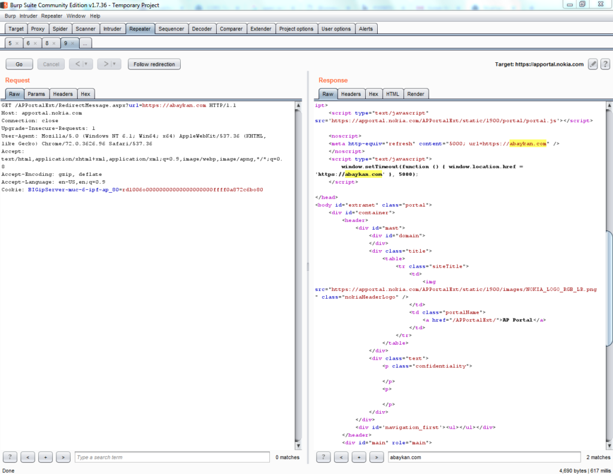
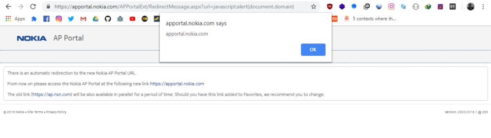

**Nokia Bug Bounty** - Ini adalah write-up tentang bagaimana saya mengubah Open Redirect menjadi XSS pada subdomain situs Nokia.

### Open Redirects

Saya menemukan sebuah report pada [OPENBUGBOUNTY](https://www.openbugbounty.org/reports/624192/), dimana pada report tersebut yang dilaporkan adalah Open Redirect pada subdomain Nokia.

Saat melihat parameter url, pemikiran instan saya adalah untuk menguji Open Redirect. Jadi saya memasukkan url `https://abaykan.com` sebagai nilai parameter dan ternyata benar mengarahkan saya ke **abaykan.com**

https://apportal.nokia.com/APPortalExt/RedirectMessage.aspx?url=https://abaykan.com  

Untuk info lebih lanjut tentang Open Redirect, silahkan membaca artikel saya di [Open Redirect Vulnerability](https://akbar.kustirama.id/open-redirect-vulnerability/). Pada artikel tersebut saya jelaskan contoh, sebab, contoh eksploitasi sampai contoh URL Vuln yang ada di beberapa situs besar.

Okee, cukup untuk pembuka, sekarang kita masuk pada apa yang saya temukan pada situs Nokia.

### Open Redirect to XSS

Selanjutnya adalah memeriksa apakah parameter tersebut juga rentan terhadap XSS. Saya memberikan `javascript:alert(document.domain)` sebagai nilai parameter dan ternyata alert box nya benar - benar muncul.

https://apportal.nokia.com/APPortalExt/RedirectMessage.aspx?url=javascript:alert(document.domain)

Bagaimana bisa memunculkan alert-box menggunakan `javascript:`? Ada beberapa cara menjalankan Javascript. Bisa dengan tag HTML `<script>`, bisa juga menggunakan `javascript:`yang kita tulis langsung di address-bar.

### Referensi

- https://akbar.kustirama.id/open-redirect-vulnerability/
- https://github.com/swisskyrepo/PayloadsAllTheThings/tree/master/Open%20redirect
- https://codelatte.org/cara-penulisan-javascript-yang-baik-dan-benar/

