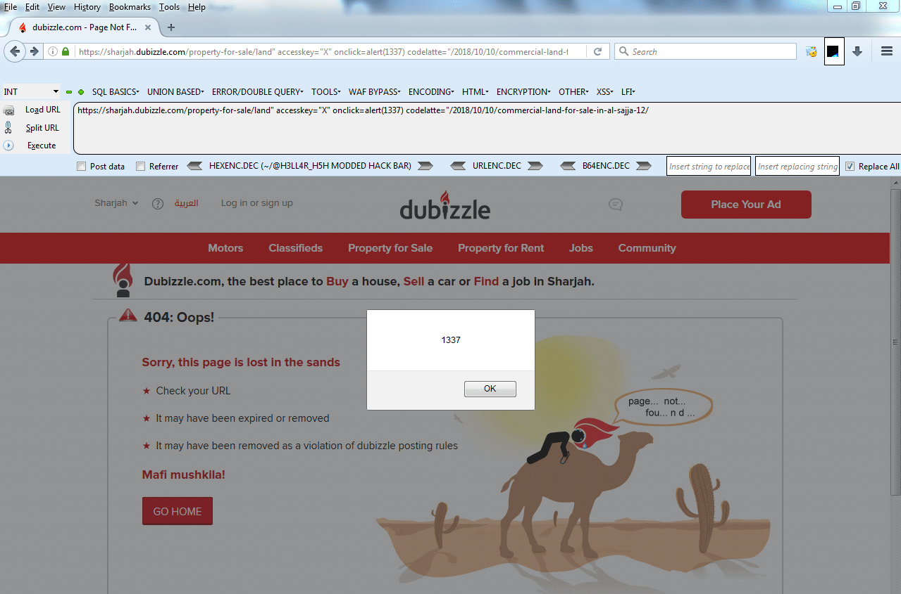
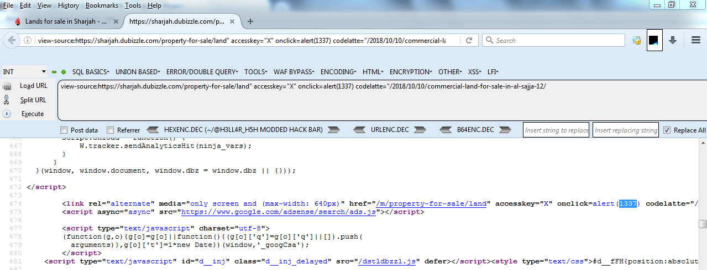

**OLX Bug Bounty: Reflected XSS** - Siapa yang akan menyangka kalau bahkan ada bug yang bisa kita temukan di halaman **404 Not Found** kan? Kali ini adalah write up saya saat menemukan **Reflected XSS** pada salah satu domain in scope oleh OLX, sharjah.dubizzle.com.

Sebelum melanjutkan membaca, silahkan baca [Disclaimer](https://akbar.kustirama.id/disclaimer/) terlebih dahulu. Dengan membaca dan/atau mempraktekkan apa yang saya tulis, kamu dianggap bersedia dengan apa yang saya tulis disana :D


### XSS pada HTML Link Tag

XSS dalam HTML Link Tag (`<link>`) dan hidden input (`<input type="hidden">`) seringkali sangat sulit untuk dieksploitasi karena event JavaScript yang khas seperti `onmouseover` dan `onfocus` tidak dapat ditrigger karena elemennya tidak terlihat (hidden).

Saya mencoba banyak hal seperti autofocus, trik CSS, dan hal-hal lain. Akhirnya saya berpikir tentang apakah event `onclick` bisa ditrigger pada hidden input melalui tombol keyboard. **BISA**. Caranya adalah dengan menggunakan element `accesskey`.

`<input type="hidden" accesskey="X" onclick="alert(1)">`  

Ini berarti kita dapat menjalankan payload XSS di dalam atribut hidden, asalkan kita bisa membujuk korban agar menekan kombinasi tombol pada keyboard.

Pada **Firefox Windows / Linux** kombinasi kuncinya adalah **ALT + SHIFT + X** dan pada **OSX** adalah **CMD + ALT + X**. Kamu bisa menentukan kombinasi tombol yang berbeda menggunakan kunci yang berbeda di atribut `accesskey`.

Cara ini tidak ideal karena melibatkan beberapa interaksi pengguna, tetapi jauh lebih baik daripada `expression()` yang hanya berfungsi pada IE <= 9.

\[the\_ad id="642"\]

### OLX Bug Bounty: Reflected XSS

Sekarang tinggal kita mengaplikasikan nya pada halaman yang saya temukan. Tanpa menunggu lama saya memasukkan payload seperti diatas,

```
https://sharjah.dubizzle.com/property-for-sale/land" accesskey="X" onclick=alert(1337) codelatte="/2018/10/10/commercial-land-for-sale-in-al-sajja-12/
```

Dan hasilnya adalah,



Voila! Saya berhasil men-trigger XSS pada salah satu domain in-scope OLX :D Untuk info lebih lanjut tentang program Bug Bounty dari OLX, silahkan cek [https://hackerone.com/olx](https://hackerone.com/olx).

`" accesskey="X" onclick=alert(1337) codelatte="`

Penjelasan singkatnya seperti ini:

- `"` = digunakan untuk 'melepaskan diri' dari attribut `href`.
- `accessskey="X"` = mendefinisikan tombol kombinasi untuk mentrigger payload.
- `onclick=alert(1337)` = event Javascript untuk memunculkan alert.
- `codelatte="` = attribut tambahan untuk menutup attribut `href` yang terbuka.



Saya melaporkan temuan ini kepada [OLX](https://hackerone.com/olx) melalui HackerOne, di halaman tersebut juga tersedia syarat maupun peraturan untuk mengikuti program Bug Bounty dari OLX. Dan ini adalah report valid pertama saya setelah sebelumnya beberapa kali mendapat _duplicate_😂

Setelah temuan bug selesai diperbaiki, nama saya masuk pada halaman Security Hall of Fame😎

### Timeline

1. Mar 03, 2019 - Mengirim laporan bug pada OLX.
2. Mar 07, 2019 - OLX menyatakan report saya valid & meminta data untuk **Security Hall of Fame**.
3. Mar 12, 2019 - Bug selesai diperbaiki.

**Mukhammad Akbar (Codelatte)**<br/>[https://security.olx.com/security-hall-of-fame.html](https://security.olx.com/security-hall-of-fame.html)

### Referensi

- https://hackerone.com/reports/504984 (Original report).
- https://portswigger.net/blog/xss-in-hidden-input-fields (XSS in hidden input fields).
- https://developer.mozilla.org/en-US/docs/Web/HTML/Global\_attributes/accesskey
