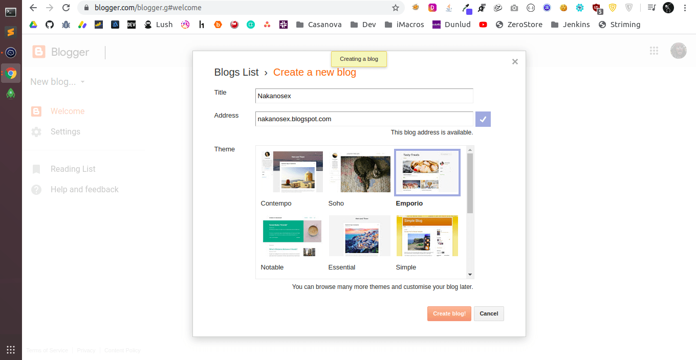
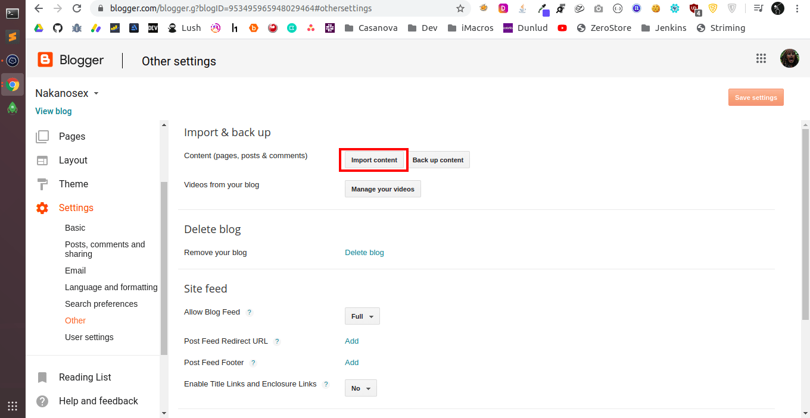
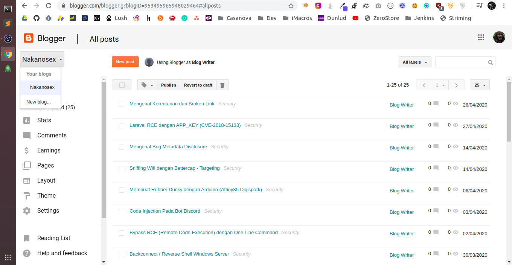
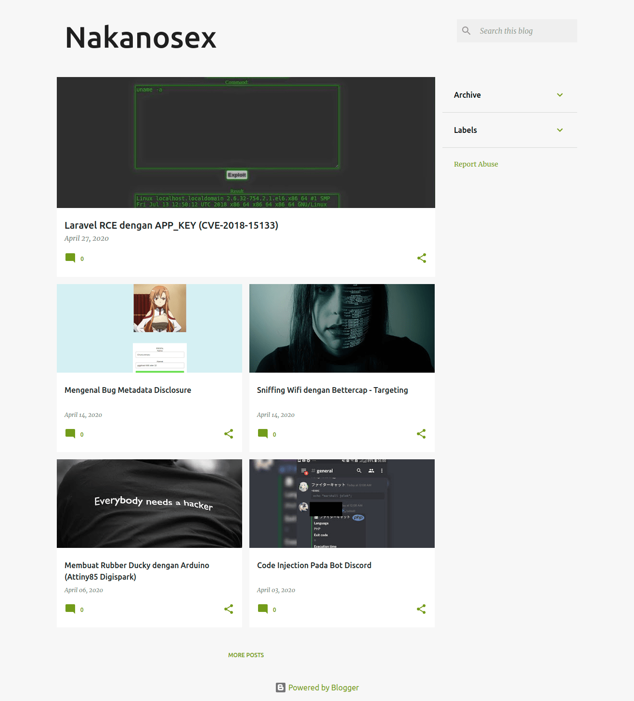

**Optimasi SEO dan Mengambil Artikel dari Blog Lain melalui Atom.xml** - Sebenarnya, trik ini digunakan oleh mereka yang 'hanya' mencari uang dari kegiatan blogging. Mengambil artikel blog lain bisa kita lakukan bahkan tanpa menggunakan `copy` + `paste`. Kita hanya perlu memanfaatkan fitur bawaan dari Blogger, `atom.xml`.

## Optimasi SEO dan Mengambil Artikel dari Blog Lain melalui Atom.xml

Alamat sitemap mengindikasi setiap artikel, url, gambar bahkan update dari blog kita. Sitemap ini juga yang akan kita gunakan untuk melakuakn SEO pada [blog](https://akbar.kustirama.id/category/blog/) kita dengan cara mengirimnya ke Webmaster seperti Google, Bing dan mesin pencarian lainnya.

Namun, kita juga bisa mengambil keseluruhan artikel dari blog milik orang lain dengan memanfaatkan sitemap pada blog tersebut, `atom.xml`. Sebelum masuk lebih dalam, kita kenali dulu apa itu \`atom.xml\` pada blogger.

### Apa itu atom.xml pada Blogger?

Pada penjelasan [Google](https://webmasters.googleblog.com/2014/10/best-practices-for-xml-sitemaps-rssatom.html), ada beberapa tipe sitemap, diantaranya adalah;

- XML Sitemap
- RSS
- Atom

Perbedaan penting antara format-format tersebut adalah, sitemap XML menggambarkan seluruh URL dalam suatu situs, sementara RSS/Atom feed menggambarkan perubahan terbaru.

Sitemap pada blogger sudah dibuat khusus dan tersedia otomatis seperti misalnya; [http://www.nakanosec.com/sitemap.xml](http://www.nakanosec.com/sitemap.xml). Namun, ada tipe lain untuk sitemap yang bisa kita kirim juga ke mesin pencari.

Mengutip dari [Bloggerbook Blakbin](https://bloggerbook.blakbin.com/2018/10/what-is-sitemap-in-blogspot-blogger-blog.html), Atom Syndication Format adalah bahasa XML yang digunakan untuk umpan web. Sedangkan Atom Publishing Protocol (AtomPub atau APP) adalah protokol sederhana berbasis HTTP untuk membuat dan memperbarui sumber daya web.

http://www.nakanosec.com/atom.xml?redirect=false&start-index=1&max-results=500

Atom.XML memiliki batas 500 artikel, jadi jika kita memiliki 1000 artikel, maka kita harus membaginya menjadi dua bagian.

http://www.nakanosec.com/atom.xml?redirect=false&start-index=501&max-results=500

### Mengambil Seluruh Artikel Blog Lain tanpa Copy & Paste

Cara mengambil seluruh artikel blog milik orang lain cukup mudah, tanpa perlu menggunakan tool dan sebagainya. Ikuti langkah di bawah ini;

1\. Buat blog baru, dengan begitu tidak akan ada post apapun di dalamnya.

2\. Pilih blog yang akan kita ambil artikelnya. Di sini, saya menggunakan blog milik teman saya yang baik hati sebagai demo untuk blog yang akan kita ambil seluruh artikelnya.

3\. Buka halaman atom milik blog yang sudah kamu pilih, misalnya [http://www.nakanosec.com/atom.xml](http://www.nakanosec.com/atom.xml). Lalu simpan file tersebut dengan ekstensi `.xml`.

4\. Buka halaman Impor Konten dengan cara klik **Settings > Other**.

5\. Impor file XML yang sudah kita simpan pada langkah nomor 3. Tunggu sementara Blogger sedang mengimpor artikel. Dan kita akan mempunyai seluruh konten dari blog tersebut.

Selesai. Dengan langkah sederhana tadi kita sudah mempunyai keseluruhan artikel yang ada di blog orang lain. Proses tersebut akan mengimpor keseluruhan bagian dalam artikel termasuk label dan tanggal ketika artikel tersebut dipublish.

Dengan begini saya mempunyai blog [Nakanosex](https://nakanosex.blogspot.com/) hasil cloning dari [Nakanosec](http://www.nakanosec.com/). Selanjutnya tinggal m̶e̶l̶a̶p̶o̶r̶k̶a̶n̶ ̶p̶l̶a̶g̶i̶a̶r̶i̶s̶m̶e̶ ̶b̶l̶o̶g̶ ̶a̶s̶l̶i̶ ̶k̶e̶ ̶D̶M̶C̶A̶ lakukan terserah kamu. Kamu bisa menggunakan blog hasil _cloning_ tersebut untuk Adsense dan sebagainya.
