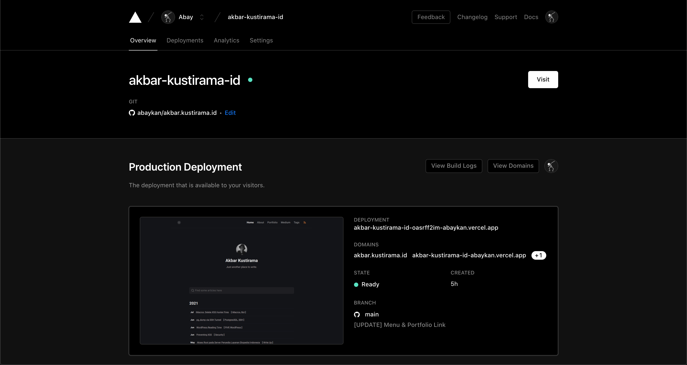

**Pindahan ke Jekyll** - Dulu saat pertama ingin menulis di blog, saya mencari platform yang simple, gampang diatur dan murah. WordPress adalah platform _blogging_ paling terkenal saat itu (mungkin sampai sekarang). Sebenarnya persyaratan tadi sudah terpenuhi kalau saya tetap menggunakan WordPress, hanya saja, ada beberapa masalah di luar persyaratan tersebut yang akhirnya membuat saya memutuskan untuk pindah dan menggunakan Jekyll.

## Kenapa Pindah dari WordPress?
WordPress adalah _CMS blogging_ paling populer dan dilengkapi banyak plugin yang bisa diinstal dengan mudah. Selain itu, WordPress juga menawarkan _backend admin_ yang bagus di mana kita bisa mengelola semuanya; mulai dari komentar, post sampai pengaturan _Google Analytics_ dan lainnya. 

Saya belum pernah menggunakan WordPress sebelumnya, tetapi dari beberapa artikel yang saya temukan di Google dan beberapa saran dari teman-teman, saya membuat blog pertama saya menggunakan WordPress. Selang beberapa waktu, saya mulai mengubah tema dan membuat beberapa perubahan tampilan dan lain-lainnya. Saat itulah "masalah" dimulai.

Saya justru lebih sering menghabiskan waktu untuk memilih tema mana yang sebaiknya saya pakai, plugin apa saja yang harus saya install, setelah itu kembali lagi mengubah tampilan tema sesuai apa yang bisa dan ingin saya ubah. Banyaknya tema dan plugin yang saya install, tentu saja membuat situs saya semakin lambat untuk dibuka.

Penambahan-pengurangan sana-sini hanya membuat saya akhirnya lebih fokus menggonta-ganti tampilan blog saya, alih-alih memperbarui tulisan seperti niat awal saya.

Alasan kedua adalah karena beberapa plugin yang saya gunakan tidak kompatibel dengan versi WordPress paling baru yang sudah penggunakan _PHP 8_. Beberapa plugin saya masih _stuck_ pada _PHP 7_.

## Kenapa Pindah ke Jekyll?
Saya sudah mencoba Jekyll beberapa waktu sebelumnya, bahkan saya sempat menulis tentang <a href="https://codelatte.org/membuat-blog-di-github-menggunakan-jekyll/" target="_blank">Cara Membuat Blog di Github Menggunakan Jekyll</a>. Selama itu juga saya melihat banyak tema Jekyll yang simple, rapi, bersih, _kan gemes_.

Alasan utama adalah Jekyll bisa menggunakan GitHub sebagai hostnya, jadi saya tidak perlu mengeluarkan biaya untuk sewa hosting. Dan tentunya lebih ringkas juga karena saya bisa mengelola seluruh situs dalam satu repositori.

Alasan keduanya, <a href="https://github.com/piharpi/jekyll-klise" target="_blank">tema yang saya pakai</a> ini sudah saya anggap "paket komplit." Tema ini sudah dilengkapi mode terang dan gelap, responsive (_desktop, tab & mobile_), mendukung SEO, _generate `sitemap.xml`_, dan banyak fitur lainnya.

Alasan ketiga adalah saya merasa kinerja penyedia hosting yang saya pakai sebelumnya agak berkurang. Beberapa kali _down_, bahkan sempat 3-4 kali _down_ dalam sehari. Sekarang, karena ada sesuatu yang tidak memungkinkan untuk blog saya berjalan di GitHub Pages, blog Jekyll saya menggunakan Vercel, _ya tetep gratis sih_.

## Kenapa _Domain_-nya Berubah Juga?
Bosen.