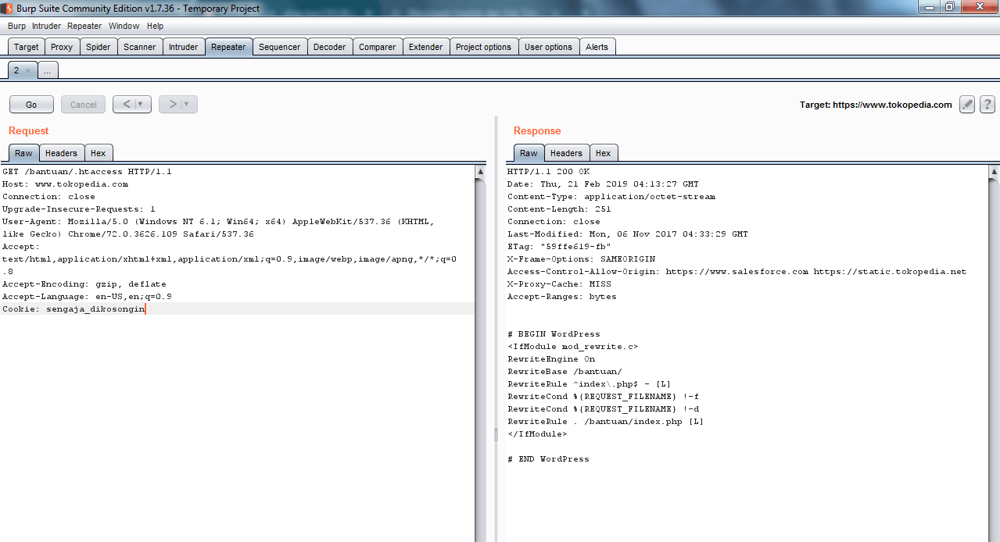
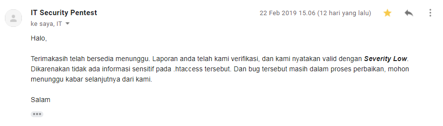

Karena ga terlalu ribet, jadi langsung aja ke poc nya aja gausah kepanjangan wkwk😂

### Apa itu .htaccess?

File `.htaccess` adalah file konfigurasi untuk digunakan pada server web yang menjalankan Apache Web Server. File `.htaccess` ini dapat digunakan untuk mengubah konfigurasi Apache Web Server untuk mengaktifkan / menonaktifkan fungsionalitas dan fitur tambahan yang ditawarkan Apache Web Server.

File `.htaccess` menyediakan cara untuk melakukan perubahan konfigurasi berdasarkan direktori.

Pada dasarnya, ini memungkinkan kita untuk mengambil arahan yang biasanya akan diletakkan di file konfigurasi utama Apache, dan menempatkannya di file konfigurasi khusus direktori. File ini sebagian besar digunakan dalam kasus di mana kita tidak memiliki akses ke file konfigurasi utama (shared host).

### Readable .htaccess

Biasanya, hanya server web yang diizinkan membaca file `.htaccess`, tetapi dalam kasus ini, tampaknya ada kesalahan konfigurasi yang menyebabkan konten `.htaccess` yang berada di situs Tokopedia dapat dibaca oleh siapapun.

`https://www.tokopedia.com/bantuan/.htaccess`

Meskipun tampaknya tidak ada informasi sensitif di sini, namun tetap ada kesalahan konfigurasi server yang harus diperbaiki.

```
abay@codelatte:~$ curl https://www.tokopedia.com/bantuan/.htaccess
BEGIN WordPress
RewriteEngine On RewriteBase /bantuan/ 
RewriteRule ^index.php$ - [L] 
RewriteCond %{REQUEST_FILENAME} !-f 
RewriteCond %{REQUEST_FILENAME} !-d 
RewriteRule . /bantuan/index.php [L] 
END WordPress
```



Setelah melihat-lihat beberapa referensi tentang readable `.htaccess` di [Hackerone](https://hackerone.com/reports/123074), saya melaporkan temuan ini kepada Tokopedia.



Dan setelah menunggu bug diperbaiki, saya diberi sertifikat sebagai reward atas temuan bug ini.

Jadi gini bapak-ibu sekalian. Apa sampeyan cukup cepat menangkap persamaan dan perbedaan write up ini dengan sebelumnya di [Tokopedia Bug Bounty: Reflected XSS Careers Page](https://akbar.kustirama.id/bug-bounty-tokopedia-careers-page/)? 😆

### Timeline

- Feb 22, 2019 02:42 PM - Mengirim laporan ke Tokopedia.
- Feb 22, 2019 03:06 PM - Tokopedia menyatakan bug valid dengan _severity low_.
- Mar 06, 2019 11:19 AM - Bug selesai diperbaiki.
- Mar 06, 2019 12:43 AM - Tokopedia memberikan sertifikat sebagai reward.

### Referensi:

- https://hackerone.com/reports/123074
- http://www.htaccess-guide.com/