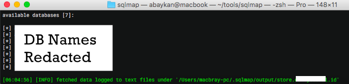
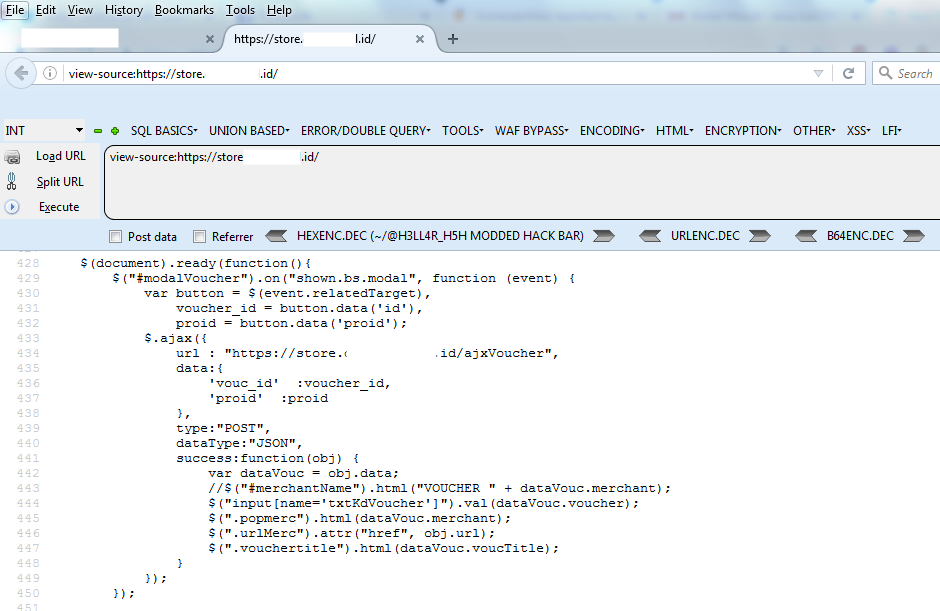

**SQL Injection pada Situs Media Indonesia** - Kali ini saya akan membahas tentang _SQLi_ yang saya temukan pada salah satu situs media di Indonesia.

Sebelum melanjutkan, silahkan baca [Disclaimer](https://akbar.kustirama.id/disclaimer/) terlebih dahulu. Jika kamu setuju dengan pernyataan disana, silahkan melanjutkan membaca.

## SQL Injection pada Situs Media Indonesia

Singkat cerita saya melihat salah satu teman di Facebook membagikan tautan dari _redacted.id_. Setelah membaca beberapa artikel disana, muncul niat iseng untuk melakukan _pentetration testing_ pada situs tersebut, lol. Okee, kita coba mencari sesuatu disana.

Setelah cukup lama berkutat pada domain utama, saya mencoba mencari peruntungan pada subdomain store, **store.redacted.id**. Saya menemukan inject point untuk melakukan SQL Injection. Untuk mempercepat waktu, saya menggunakan SQLMap untuk memastikan apakah url tersebut memang vuln.

`sqlmap -u http://store.redacted.id/ajxVoucher --data="vouc_id=123*&proid=1" --dbs`

*Jika ada beberapa parameter dan hanya salah satu yang bisa menjadi inject point, kamu bisa menambahkan (\*) sebagai penanda untuk SQLMap bahwa disanalan inject point berada*

Dan setelah menunggu beberapa waktu untuk SQLMap melakukan tugasnya, ternyata url tersebut vuln terhadap SQL Injection.

**_Kok bisa dapat inject point disitu?_**

Saya melihat file _[javascript](https://codelatte.org/category/javascript/)_ di bagian bawah halaman, terdapat action request yang digunakan untuk cek voucher (atau apalah itu). Tampak seperti gambar di bawah ini:

## Timeline

1. Feb 23, 2019 09:36 AM - Mengirim laporan ke _redacted.id_
2. Feb 23, 2019 09:50 AM - Menerima balasan _redacted.id_ dari _redacted.id_ jika bug akan segera diperbaiki & meminta alamat untuk pengiriman merchandise.

### Penutup
Temuan ini adalah temuan lama yang saya temukan beberapa bulan lalu. Karena belum diberikan izin untuk publikasi write up, status write up ini masih _draft_ selama beberapa bulan. Dan karena sampai sekarang belum ada jawaban, saya memutuskan mengubah sekenanya dan tetap mempublish write up ini dengan tidak menampilkan nama situs tersebut.
