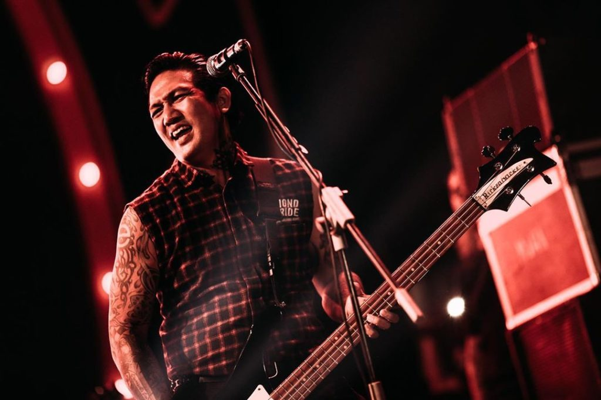
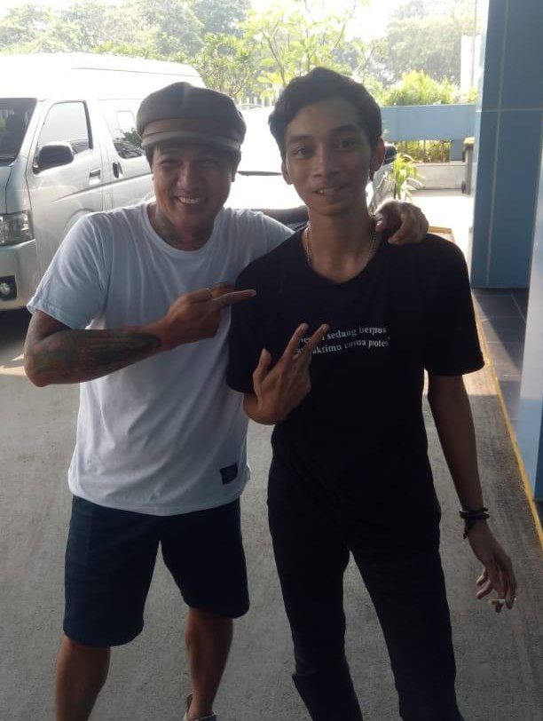

**Superman Is Dead: Eka Rock, Punkrock atau Developer?** - Saya bisa dibilang outsider _die hard_ di saat-saat tertentu. Dulu saya sempat ngindex (deface) di web Superman Is Dead, trus di restore, karena cuma direstore doang, saya kurang puas, saya kan pengen dinotice wkwk. Yaudah akhirnya ngindex lagi, itu sampe 3-4 kali ngindex-restore nya.

Sampe akhirnya Ekarock bikin satu post yg dipublish di akun Facebook beliau, FansPage SID, web SID nya langsung, dan kirim pesan ke FansPage tim saya, intinya, "Kalo pun ada kejadian kek gini, kami cuma bakal restore ke settingan lama. Gabakal ada perpanjangan kasus, dll, karna buat apa kita perang sama saudara sendiri? Kamu (maksudnya saya) punya dan bisa obrak abrik situs, sangat disayangkan kalo ada kejadian kayak gini".

### Superman Is Dead: Eka Rock, Punkrock atau Developer? Why Not Both?

Mendapat respon dari Ekarock yang notabene bassis SID dan developer SID, perasaan saya berkecamuk. Senang, bangga, malu, merasa bersalah. Sampai akhirnya saya meminta maaf atas kelakuan saya itu. Karena pada saat itu, ada orang lain yang membuat suatu 'challenge' dimana _goals_ dari challenge tersebut adalah memunculkan database name dari suatu situs yang dijadikan ajang challenge. Dan yang dijadikan challenge saat itu adalah website Superman Is Dead.

Saya menjelaskan hal tersebut dan niat saya yang bukan untuk usil—selain ingin dinotice tentunya—yaitu ada rasa yang mengganjal ketika situs band idola saya dijadikan ajang untuk test skill orang-orang tertentu.

Sebagai permintaan maaf saya waktu itu, saya menawarkan diri untuk membantu melakukan perbaikan pada situs Superman Is Dead. Hal tersebut saya utarakan karena perasaan tidak enak saya ketika mengetahui ternyata Ekarock sendiri yang membuat website SID dari _nol_. _Bayangin om-om tattoan berambut klimis ternyata jago bikin website!_

[instagram.com@ekarock](https://www.instagram.com/ekarock/)

### Sampai Akhirnya Ngobrol Secara Langsung

Suatu ketika, ada acara yang juga dihadiri Superman Is Dead, di Jakarta, acara berlangsung di [JIEXPO Kemayoran, Jakarta](http://www.supermanisdead.net/calendar/calendar.php?year=2019&today=8&month=6). Dengan modal nekat, saya sekali lagi DM Ekarock untuk minta waktu sejenak untuk mengabadikan momen. Dan sayangnya tidak terbalas. _Sad_. Sampai acara selesai, kurang lebih jam 11 malam saat itu, JRX memposting ulang satu _instastory_ dari OSD yang berfoto dengan beliau. Dan di story yang diposting ulang tersebut ada lokasi yang ditandai dan saya berpikir mungkin tempat tersebut adalah hotel tempat SID bermalam.

Tanpa banyak ba-bi-bu saya bergegas ke lokasi tersebut. Namun karena saya orang baru dan sempat _nyasar_ beberapa kali, saya tiba di hotel tersebut jam 1 malam. Lobi hotel sudah sepi, tidak ada _outsider_ atau _ladyrose_ yang terlihat. Saya memastikan hotel tersebut benar tempat SID bermalam dengan bertanya ke satpam di hotel tersebut.

Setelah mendapat jawaban benar dari pak satpam tersebut, saya dilema. Jarak antara hotel dan kosan saya lumayan juga. Antara pulang dan hanya mendapat kesenangan konser SID, atau menunggu di sekitar hotel tersebut. _Shit, I feel like I look like a stalker_.

Setelah habis beberapa gelas kopi di warung terdekat, matahari makin terang, hawa makin panas, bau badan belum mandi makin menusuk, tepat jam 10 pagi, sosok Ekarock muncul keluar hotel.

### "Ohh Abay, apa kabar? Lagi sibuk ngerusak apa sekarang?"

Tanpa menunggu lagi langsung saya datangi dan saya todong salaman sambil bilang, "Bli, saya Abay." Muka beliau tampak bingung sejenak sampai akhirnya saya tambah lagi, "Itu ... yang website SID." Wajah beliau langsung berubah tengil, seperti biasa. Jawaban beliau waktu itu, yang bakal saya ingat sampai kapanpun, "Ohh Abay, apa kabar? Lagi sibuk ngerusak apa sekarang?" katanya dengan senyum di wajah dan mimik muka makin tengil.

Ini perwujudan dari mata yang kurang tidur, lemas pasca jingkrak-jingkrak, bau badan karna belum mandi dan kembung kebanyakan kopi warung sebelah.

Saya mengagumi beliau karena dengan 'tampang' sedemikian rupa, beliau yang membangun website Superman Is Dead dari _nol_. _Pangrok yang juga developer web_, kurang apalagi idola saya ini?

Saya mengagumi personel SID dengan ciri khas dan pembeda mereka masing-masing. Bobby Kool dengan suaranya yang garang, JRX sebagai public enemy yand dirindukan, dan tentunya Eka Rock dengan background IT nya.

Semoga saya bisa mendapat kesempatan mengabadikan momen untuk kali kedua, ketiga, dan seterusnya~
