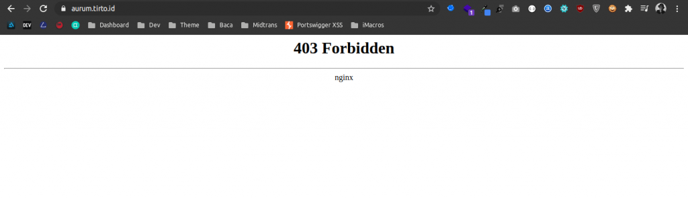
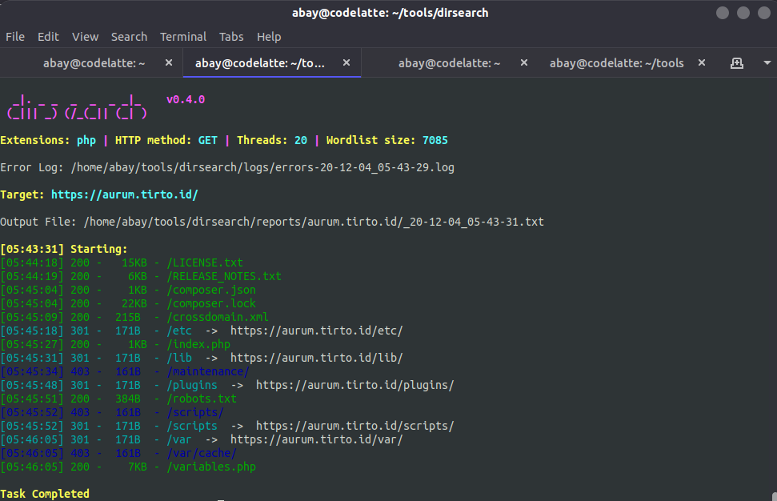
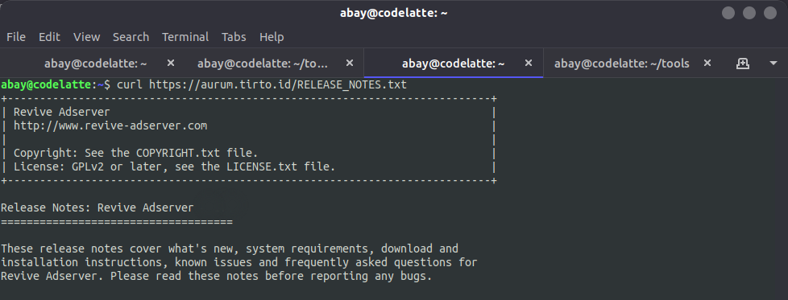
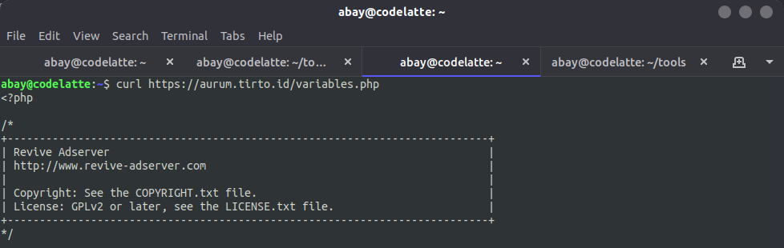
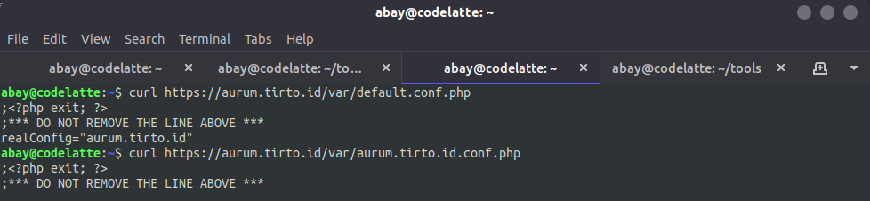

**Tirto Bug Bounty: Miskonfigurasi Server Tirto.id** - Setelah sekian lama akhirnya ada yang mengizinkan saya mempublish temuan bug yang saya laporkan😂

Kali ini saya menemukan miskonfigurasi pada server Tirto. Dan seperti sebelum-sebelumnya, tim IT Tirto sangat cepat & tanggap terkait laporan bug pada situs mereka.

Baca juga: [Mendapat Hadiah dari Pak Tirto](https://akbar.kustirama.id/mendapat-hadiah-dari-pak-tirto/).

### Tirto Bug Bounty: Miskonfigurasi Server Tirto.id

Saya mencoba melakukan scanning pada `aurum.tirto.id`. Saat diakses, subdomain ini langsung menunjukkan respon 403 Forbidden.

Proses pertama yang saya lakukan adalah mencari path yang mungkin tidak terlihat "secara kasar". Untuk melakukan path scanning, kamu bisa menggunakan [DirSearch](https://github.com/maurosoria/dirsearch).

Pada screenshot di atas terdapat file `RELEASE_NOTES.txt` yang mungkin berisi informasi tentang aplikasi yang digunakan `aurum.tirto.id`.

Setelah mengetahui bahwa aplikasi yang digunakan adalah **Revive AdServer**, saya sempat mencari exploit untuk versi tersebut namun tidak ada yang cocok.

Saya mencoba mengakses file `variables.php` yang terlihat pada screenshot kedua, ternyata file tersebut bisa diakses tanpa perlu otentikasi apapun.

Mengetahui hal ini, saya mencari source code Revive AdServer dan menemukan ternyata aplikasi ini [open source](https://github.com/revive-adserver/revive-adserver/).

Diketahui dari dokumentasi dan pencarian singkat, file config untuk Revive AdServer berada pada direktori `[path]/var/default.conf.php`. Yang berarti, file konfigurasi pada aurum.tirto.id adalah `realConfig="aurum.tirto.id"`. Maka, file konfigurasi terletak di `[path]/var/aurum.tirto.id.conf.php`.

Dari file konfigurasi tersebut, saya mendapat data untuk keperluan login database dan data-data lainnya.

Sampai pada temuan data-data tersebut saya menghentikan percobaan dan melaporkan temuan ini pada tim IT Tirto. Dan laporan saya selesai ditanggapi, diperbaiki dan ditindaklanjuti dalam waktu kurang dari 3 hari.

* * *

### Timeline:

- Jan 04, 2021 - Melaporkan temuan bug.
- Jan 05, 2021 - Bug selesai diperbaiki.
- Jan 06, 2021 - Reward sent.
