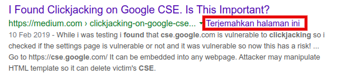
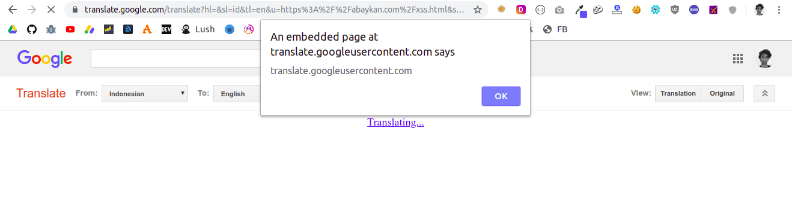

**XSS Google Translate (Sandbox Domain)** - Tulisan kali ini adalah tentang temuan XSS pada situs raksasa internet, _Google_. Kalau yang kalian cari adalah nominal yang diberikan Google terhadap temuan ini, _mending ngga usah lanjut, udah cabut aja~_

Sebenarnya 2 temuan ini tidak valid karena masuk pada _Sandbox Domain_ Google. Namun, bagian menariknya adalah dimana dan bagaimana payload XSS nya tertrigger~

## XSS Google Translate

Perlu diketahui, Google mempunyai list domain yang tidak masuk pada scope yang dapat memperoleh bounty. Karena beberapa domain ini tidak bisa mengakses data pengguna secara langsung, seperti kata Google;

"_Google uses a range of sandbox domains to safely host various types of user-generated content. Many of these sandboxes are specifically meant to isolate user-uploaded HTML, JavaScript, or Flash applets and make sure that they can't access any user data_". -[XSS in Sandbox Domains](https://sites.google.com/site/bughunteruniversity/nonvuln/xss-in-sandbox-domain)

Tentunya saat saya mendapatkan XSS ini, saya berharap bahwa payload saya tidak hanya tertrigger di Sandbox Domain Google, _tapi ya mo gimana lagi, cuk. Belom rejeki~_

Baca juga: [Clickjacking in Google CSE. Is This Important?](https://medium.com/@abaykandotcom/clickjacking-on-google-cse-6636bba72d20)

### XSS Saat Menerjemahkan Dokumen

Saat membuka _**translate.google.com**_, ada sebuah fitur dimana Google akan menerjemahkan isi dari sebuah dokumen, dimana ekstensi dokumen yang diperbolehkan adalah; **doc**, **.docx**, **.odf**, **.pdf**, **.ppt**, **.pptx**, **.ps**, **.rtf**, **.txt**, **.xls**, atau **.xlsx**.

Langkahnya cukup sederhana. Saya hanya membuat file **txt** dimana isi dari file tersebut adalah payload XSS biasa;

``

### XSS Saat Menerjemahkan Situs

Fitur keren lain dari Google Translate adalah, kita bisa menerjemahkan suatu halaman/situs. Dimana fitur tersebut biasanya muncul saat kita melakukan pencarian di Google.

Langkahnya juga termasuk sederhana, saya mengupload file HTML berisi payload XSS lalu menerjemahkan file/halaman tersebut via Google. Sehingga keseluruhan URL adalah: [https://translate.google.com/translate?sl=id&tl=en&u=https://abaykan.com/xss.html](https://translate.google.com/translate?sl=id&tl=en&u=https://abaykan.com/xss.html)

Payload yang ada di halaman [abaykan.com/xss.html](https://abaykan.com/xss.html) tertrigger.

Jika penjelasan diatas kurang jelas, silahkan simak video yang saya buat di bawah ini:

<iframe width="100%" height="315" src="https://www.youtube.com/embed/vkdkO1_0UMw" title="YouTube video player" frameborder="0" allow="accelerometer; autoplay; clipboard-write; encrypted-media; gyroscope; picture-in-picture" allowfullscreen></iframe>

Sekian tulisan singkat saya kali ini. Sekali lagi, yang saya ingin bahas adalah bukan tentang program bug bounty dari Google nya, melainkan bagaimana dan dimana payload tersebut bisa tertrigger. Terima kasih.
