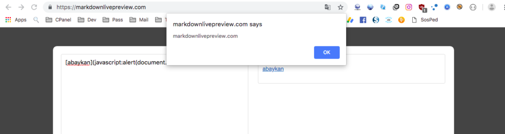
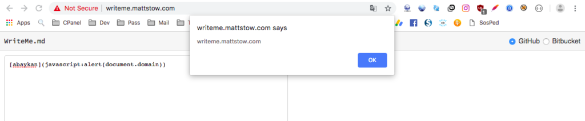
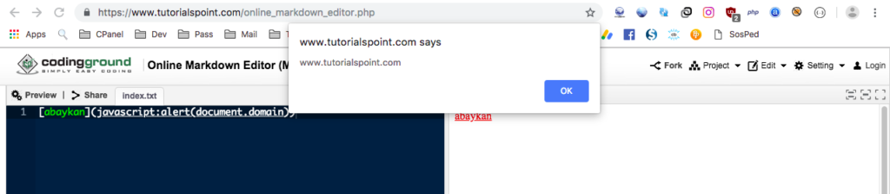
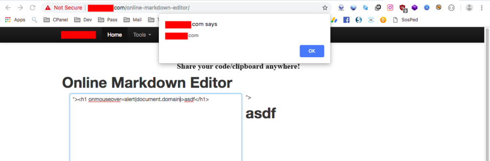
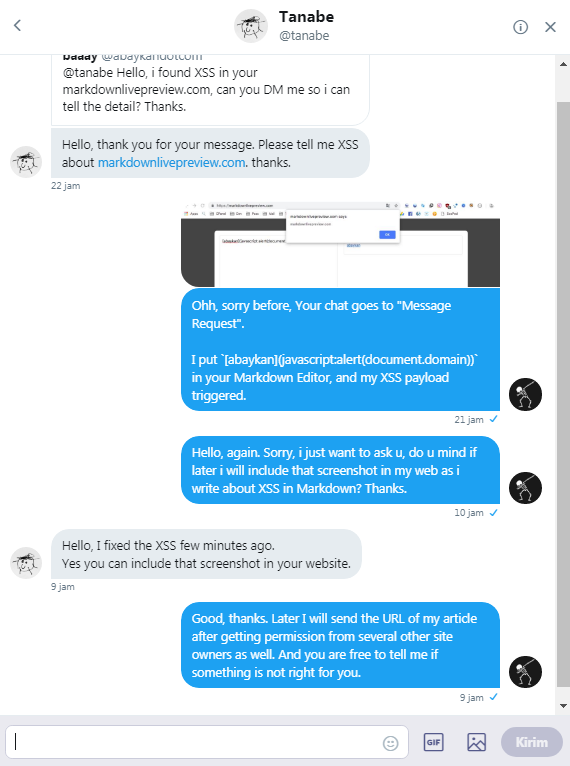

**XSS in Markdown** - Berawal dari membaca report di Hackerone, saya berhasil menemukan banyak situs yang rentan terhadap XSS. Target saya adalah situs **Online Markdown Editor**. Untuk report Hackerone yang saya maksud, silahkan lihat di [hackerone.com/reports/118024](https://hackerone.com/reports/118024).

Pada halaman report tersebut, saya perhatikan payload yang digunakan reporter adalah:

`` `[clickme](vbscript:alert(document.domain))` ``

Oke saya jelaskan sedikit tentang Markdown.

Sebelum melanjutkan lebih jauh, silahkan baca [Disclaimer](https://akbar.kustirama.id/disclaimer/) terlebih dahulu. Jika kamu menyetujui pernyataan saya disana, silahkan lanjut membaca :)

### Apa itu Markdown?

_Markdown_ adalah _(lightweight markup language)_ bahasa _markup_ yang lebih ringan dari HTML untuk _formatting_ teks.

_Markdown_ bisa dikonversi ke dalam HTML menggunakan beberapa aplikasi. Biasanya menggunakan _markdown editor_ itu sendiri. Contoh:

```
Aku *sedang* belajar **menulis** dengan [markdown](https://en.wikipedia.org/wiki/Markdown).
```

Teks ini akan dikonversi ke HTML menjadi seperti ini:

Aku _sedang_ belajar **menulis** dengan [markdown](https://en.wikipedia.org/wiki/Markdown).

Untuk penjelasan Markdown lebih jauh lihat di Google ya gan, mumpung belum tutup :D

### XSS in Markdown: Mencari Target

Tentunya setelah membaca report tersebut saya penasaran dan segera mencari situs Online Markdown Editor untuk mencoba payload tersebut.

Dari sekian banyak hasil yang muncul di Google, situs pertama yang berhasil saya inject adalah **markdownlivepreview.com**. Dengan menggunakan payload:

```
[abaykan](javascript:alert(document.domain))
```

Saya berhasil men-trigger XSS pada website tersebut.



markdownlivepreview.com

Ternyata memang berhasil :D Ternyata tidak sia-sia saya begadang malam ini :v

Satu korban tentu tidak cukup kan? Beberapa menit kemudian saya menemukan lagi situs yang vuln terhadap XSS in Markdown, yaitu **writeme.mattstow.com**. Payload yang saya gunakan masih sama seperti tadi, dan hasilnya:



writeme.mattstow.com

Okee, dua anak korban lebih baik. Sampai sini saya memutuskan untuk rehat sejenak. Bersantai sambil minum kopi tengah malam? Nikmat Tuhan mana lagi yang kau dustakan?

Namun tiba-tiba mata saya tertuju satu bagian pada halaman Google Pencarian, saya melihat Markdown Editor milik **TUTORIALSPOINT.COM**.


Tentunya tanpa menunggu lama saya mencoba melakukan injeksi editor markdown seperti sebelumnya. Dan hasilnya?



tutorialspoint.com

**Crap.** Saya menemukan XSS di website yang bahkan saya gunakan untuk belajar?

Tapi tambah satu situs lagi boleh lah ya wkwk. Namun disini ada yang menarik, ternyata masih ada situs Online Markdown Editor yang rentan terhadap HTML Injection. Sehingga bisa dimanfaatkan menjadi XSS.



Saya sensor nama domain sesuai permintaan pemilik situs

Oke, cukup. Sekarang waktunya melaporkan temuan pada pemilik situs yang bersangkutan.

FYI, saya sudah mendapat izin mempublish screenshot dari website yang saya temukan diatas (kecuali tutorialspoint.com).

Dan jika keberatan dengan isi konten, mereka (pemilik situs) saya persilahkan memberi tahu saya agar bisa saya hapus. Salah satunya adalah [@tanabe](https://twitter.com/tanabe) pemilik situs **markdownlivepreview.com** yang saya screenshot diatas.



### Penutup

Menggunakan output Markdown di `innerHTML` elemen akan menyebabkan masalah pada sebagian besar waktu. Jika kamu menggunakan `dangerouslySetInnerHTML` dari React, kamu juga bisa mendapat masalah.

Jika kamu menginginkan pengamanan maka pastikan kamu mengaktifkan opsi sanitasi di library Markdown milik kamu. Jika kamu menggunakan modul pihak ketiga, pastikan mereka mengatur opsi perpustakaan Markdown dengan benar dan mensanitasi nilai-nilai sebelum memasukkannya ke DOM.
