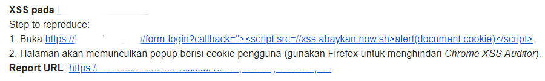
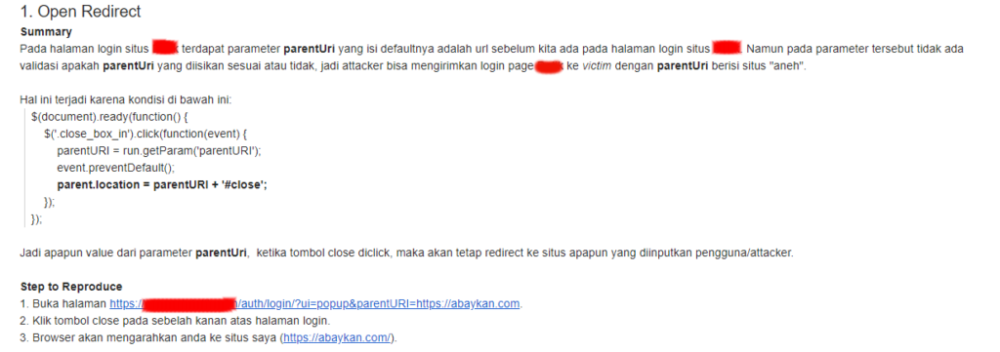
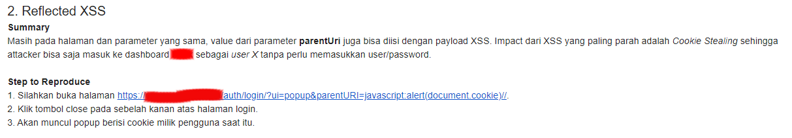

**XSS pada Halaman Login** - Semua situs di bawah ini merupakan situs media online di Indonesia. Sayangnya, karena masalah izin, saya tidak bisa menampilkan nama situs tersebut.

### Pattern Login Website

Sebagai demo, saya mengambil dua contoh temuan di situs Indonesia dan tentunya sudah saya laporkan terlebih dahulu (dan sudah diperbaiki). Dan tentunya kedua situs di bawah ini mengapresiasi pelapor bug dengan baik. Sangat baik.

Sebelumnya: [XSS Google Translate](https://akbar.kustirama.id/xss-google-translate/).

Ada satu kesamaan dalam beberapa temuan di bawah ini. Yaitu, semuanya ada di halaman login, dan payload XSS akan dieksekusi setelah pengguna berhasil login. Biasanya pada halaman login terdapat parameter _`next`_, _`callback`_, _`return`_ dan sebagainya. Di situlah payload XSS kita tanam~

Berbagai parameter tersebut tujuannya sudah jelas, yaitu, mengarahkan pengguna ke halaman yang diakses setelah login. Saat pengguna mengakses halaman yang membutuhkan otentikasi (login), sewajarnya akan langsung dialihkan ke halaman login. Dan untuk memudahkan pengguna agar tidak mencari ulang halaman tersebut, dibuatlah parameter seperti itu. Dengan tujuan, jika terjadi kondisi tersebut, pengguna tidak perlu terhenti di dashboard pengguna, melainkan langsung ke halaman yang dituju sebelumnya.

### XSS pada Halaman Login

**Contoh I**  
Pada halaman login terdapat parameter `callbac`k. Saya menemukan parameter ini ketika mengakses url `site.com/profile`. Karena saya belum login, saya diarahkan ke halaman login; `/form-login?callback=`.

Saat menyadari adanya parameter tersebut, baru lah niat iseng saya muncul. Ternyata tanpa perlu payload yang "aneh-aneh", cukup menggunakan payload yang umum dipakai.

### Contoh II
Pada halaman login terdapat parameter `parentUri` yang saya dapat setelah melihat source code javascript di halaman tersebut. Saat pertama melihat parameter ini beserta source code nya, pikiran saya langsung mengatakan "Bay, open-redirect, bay~". Jadilah laporan seperti berikut:

Namun keisengan saya tidak terhenti hanya di Open Redirect. Karena berdasarkan pengalaman—yang-belum-banyak-juga—kalau yang kita laporkan "hanya" sebatas Open Redirect, maka laporan kita akan "disepelekan". Jadilah saya tambahkan XSS ke dalam report tersebut~

Bagian menariknya adalah, pada kasus XSS tersebut, payload yang saya gunakan adalah; `javascript:alert(document.cookie)//`.

Pada akhir payload terdapat comment untuk javascript `//`. Dua karakter sialan ini sempat bikin saya pusing selama beberapa menit. Coba lihat lagi source code pada **screenshot 2.1**. Disana terdapat; `parent.location = parentURI + **'#close'**;`. Perhatikan bagian yang saya tebali.

Jika payload yang saya gunakan hanya `javascript:alert(document.cookie)`, maka keseluruhan script yang dijalankan adalah; `parent.location = 'javascript:alert(document.cookie)#close';` maka XSS tidak akan dieksekusi karena kesalahan code tersebut. Jadilah saya tambahkan dua karakter comment tersebut agar bagian **#close** tidak terbaca.

Terinspirasi dari kasus ini, saya membuat contoh kasus XSS serupa di XSS Labs Codelatte. Silahkan dicoba di [https://codelatte.net/xss/7.php](https://codelatte.net/xss/7.php). Clue nya adalah, "Jalankan kode dengan membuat kode tidak terbaca", wkwk.

Sekian tulisan singkat kali ini, semoga bermanfaat dan sampai jumpa di tulisan selanjutnya~